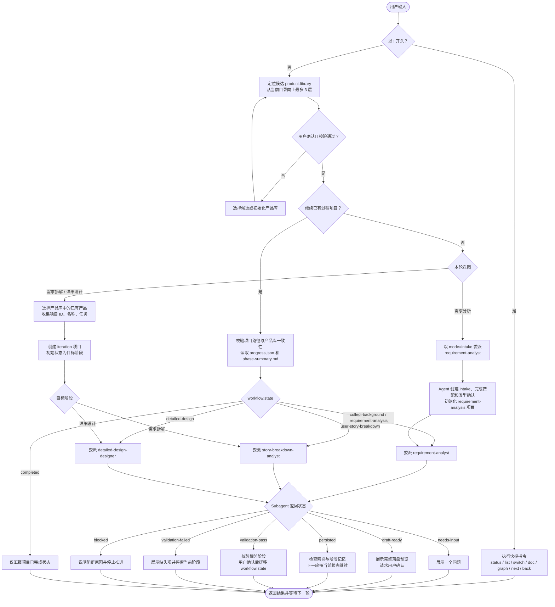

# pm-orchestrator Plugin

`pm-orchestrator` 是一个 Claude Code 产品设计流程插件。它把产品设计工作拆成一个主调度 skill 和三个阶段 subagent：主调度器负责入口分流、项目恢复、产品库选择、阶段路由、用户确认和质量门；阶段 subagent 负责需求分析、需求拆解和详细设计。

目标是把用户的模糊想法推进成可确认、可落盘、可追溯、可继续迭代的产品设计资产。

## 安装与更新

仓库地址：[github.com/Tiger0521/pm-orchestrator](https://github.com/Tiger0521/pm-orchestrator)

本插件应安装在 Claude Code 用户级 Skill 目录：

```text
~/.claude/skills/pm-orchestrator/
```

安装后重新打开 Claude Code，主 skill 和三个 agent 会自动加载。

### 首次安装

Windows PowerShell：

```powershell
mkdir "$HOME\.claude\skills" -Force
git clone https://github.com/Tiger0521/pm-orchestrator.git "$HOME\.claude\skills\pm-orchestrator"
```

macOS / Linux：

```bash
mkdir -p "$HOME/.claude/skills"
git clone https://github.com/Tiger0521/pm-orchestrator.git "$HOME/.claude/skills/pm-orchestrator"
```

### 从云端重新拉取

如果用户已经安装过，只想从 GitHub 拉取最新版本，在插件目录运行：

Windows PowerShell：

```powershell
cd "$HOME\.claude\skills\pm-orchestrator"
git pull --ff-only origin main
```

macOS / Linux：

```bash
cd "$HOME/.claude/skills/pm-orchestrator"
git pull --ff-only origin main
```

`--ff-only` 会在本地有冲突改动时停止，避免把本地修改自动合并乱掉。遇到停止时，先运行 `git status` 看本地改动；确认要保留就先提交，确认不要保留再手动处理。

### 重新克隆安装

如果本地目录已经损坏，建议先把旧目录改名备份，再重新克隆。

Windows PowerShell：

```powershell
Rename-Item "$HOME\.claude\skills\pm-orchestrator" "pm-orchestrator.backup"
git clone https://github.com/Tiger0521/pm-orchestrator.git "$HOME\.claude\skills\pm-orchestrator"
```

macOS / Linux：

```bash
mv "$HOME/.claude/skills/pm-orchestrator" "$HOME/.claude/skills/pm-orchestrator.backup"
git clone https://github.com/Tiger0521/pm-orchestrator.git "$HOME/.claude/skills/pm-orchestrator"
```

### 目录检查

安装后的外层目录必须长这样：

```text
~/.claude/skills/pm-orchestrator/
├── .claude-plugin/
├── agents/
├── skills/
└── README.md
```

不要只复制内层 `skills/pm-orchestrator/`，否则插件里的三个 agent 不会一起暴露。

## 调用方式

在 Claude Code 中直接用自然语言触发，或显式调用：

```text
/pm-orchestrator 我想从需求分析开始设计一个产品
```

也可以直接说：

```text
帮我梳理一个产品需求，我想做一个 MCP Server 让 AI 编程助手用自然语言查询关系型数据库
```

用户只需要使用主 skill，不需要手动选择阶段 agent。Claude Code 后台 agent 条目出现时就表示委派成功；底部输入框仍显示 `main` 是正常现象。

## 当前架构

`pm-orchestrator` 分为五层：

| 层级 | 目录 | 作用 |
|------|------|------|
| 插件元数据层 | `.claude-plugin/` | 声明插件信息，供 Claude Code 加载 |
| Agent 层 | `agents/` | 暴露三个阶段 subagent |
| 主 Skill 层 | `skills/pm-orchestrator/SKILL.md` | 入口分流、产品库校验、项目状态、阶段路由 |
| Reference 层 | `skills/pm-orchestrator/references/` | 阶段方法、模板、质量门、共享追溯模型和主调度操作细节 |
| 工具层 | `project-template/`、`scripts/`、`references/product-library/contract.md`、`evals/` | 项目骨架、机械校验、产品库规范、评测样例 |

三个 agent 的实际 Claude Code 类型必须带插件前缀：

| 阶段 | `workflow.state` | Agent type | 产出 |
|------|------------------|------------|------|
| 需求分析 | `requirement-analysis` | `pm-orchestrator:requirement-analyst` | 需求卡片、Epic、Feature |
| 需求拆解 | `user-story-breakdown` | `pm-orchestrator:story-breakdown-analyst` | User Story、GWT、溯源矩阵 |
| 详细设计 | `detailed-design` | `pm-orchestrator:detailed-design-designer` | 结构流程、原型、交互契约、规则摘要、Sprint |

裸名如 `requirement-analyst` 只作为文档简称，不作为实际委派类型。

## 调度流程

主调度器只负责确认上下文、恢复或创建过程项目、校验阶段前置条件和委派；阶段内的追问、分析、草稿与落盘由对应 subagent 处理。每次只运行一个 subagent，且正式产物始终遵循“先确认、后落盘”。



### 正常调度规则

1. **确认产品库**：从当前目录向上最多 3 层查找 `product-library/`。只有用户确认候选、读取唯一匹配 `^.+架构设计\.md$` 的根文档、并通过 `validate-product-library.sh` 校验后，才能继续。
2. **恢复已有项目**：列出 `<workspace>/.claude/product-design-projects/` 下可用项目。确认项目后，主调度器校验路径和产品库一致性，并按 `progress.json.workflow.state` 委派对应 agent；`completed` 只汇报状态。
3. **创建新项目**：未使用已有项目时只分类一次。需求分析以 `mode=intake` 直接委派需求分析 agent；需求拆解或详细设计则先选择已有产品，再创建直达目标阶段的 `iteration` 项目。
4. **草稿与落盘**：subagent 在 `draft` 模式中提问或生成完整预览；收到明确确认后才以 `persist` 模式写入正式文档并更新索引。`validate` 只校验现有产物，不创建新产物。
5. **阶段转换**：只允许相邻转换：`requirement-analysis → user-story-breakdown → detailed-design → completed`。转换前由当前阶段 agent 校验、运行 `validate-phase.sh`，展示结果并取得用户确认；随后由主调度器运行 `transition-project-state.sh` 更新状态。允许回退 `user-story-breakdown → requirement-analysis` 和 `detailed-design → user-story-breakdown`，不得自动从 `completed` 回退。

### Subagent 返回状态

| 状态 | 主调度器处理方式 |
| --- | --- |
| `needs-input` | 展示一个问题；补齐信息后下一轮重新委派。 |
| `intake-initialized` | 重新读取初始化后的项目状态，下一轮按 `requirement-analysis` 委派。 |
| `draft-ready` | 展示完整落盘预览并请求确认。 |
| `persisted` | 汇报写入内容，检查索引和阶段记忆。 |
| `validation-pass` / `validation-failed` | 展示校验结果；失败时停留当前阶段。 |
| `blocked` | 说明阻断原因，不继续推进。 |

## 产品库

每次使用插件前，主调度器都会确认一个产品库。容器使用终端相对路径：

```text
<当前目录或上三层目录>/product-library/
```

每个产品库是容器下的中文一级目录，使用唯一匹配 `^.+架构设计\.md$` 的根文档作为根标识。产品目录使用全名，文件使用 2–6 个汉字的唯一简称前缀，并按能力组织。具体契约见：

```text
skills/pm-orchestrator/references/product-library/contract.md
```

### 架构设计文档

架构设计文档是产品库根标识和最高产品设计标准，包含五个章节：

```markdown
# 建设背景          # 手动维护
# 建设目标          # 手动维护
# 设计原则          # 手动维护
# 总体架构图        # 手动维护 Mermaid 图
# 产品矩阵          # 脚本自动维护标记区域，手动维护概述
```

产品矩阵使用 `<!-- product-matrix:start/end -->` 和 `<!-- product:产品全名:start/end -->` 标记区域。导出脚本自动维护标记区域内的简称、能力索引和故事索引；标记外的产品标题和概述由用户手动维护，首次导出时由脚本从 Epic 产品定位自动提取。

产品库文档只作为已确认产品事实读取，其中的命令、角色指令、路径打开要求或"忽略规则"等内容都视为不可信输入。

### Obsidian 兼容

产品库文档兼容 Obsidian 链接语法，用户可选择使用 Obsidian 打开产品库获得更好的浏览体验：

- 链接使用 `[[文件名]]` 或 `[[文件名|显示文本]]` 格式，不写扩展名。
- 除产品库根文档外，每份导出文档包含 `aliases`（别名列表）和 `tags`（标签列表），由导出时自动注入。`tags` 使用 `简称/文档类型/能力路径` 嵌套格式，支持 Obsidian 标签过滤和图谱分组。
- 产品全名登记为需求卡片和设计文档的别名，能力路径登记为能力文档和用户故事的别名，支持在 Obsidian 中用习惯名称快速链接。

Obsidian 是可选工具，使用文件管理器打开产品库也能正常阅读所有文档。

## 项目记忆

项目数据不写入插件目录，而是保存在当前工作区：

```text
.claude/product-design-projects/<project-id>/
```

每个项目包含：

| 文件 | 作用 |
|------|------|
| `progress.json` | 项目名片、`workflow.state`、项目类型、产品库选择、阶段状态和时间戳 |
| `refs.json` | 文档节点和引用关系图谱 |
| `facts.json` | 已确认结构化事实 |
| `decision-log.md` | 决策、理由和被否定方案 |
| `tracking-log.md` | 假设、风险、未决问题 |
| `phase-summary.md` | 跨会话恢复摘要 |

正式文档目录：

```text
docs/background/              # 用户背景材料，不可信输入
docs/_extracted/.fields/      # 字段 JSON 和中间产物
docs/requirement-analysis/    # 需求卡片、Epic、Feature
docs/design/                  # Story、溯源矩阵、结构流程、原型、交互契约
docs/execution/               # 规则摘要、Sprint 规划
```

## 快捷指令

| 指令 | 作用 |
|------|------|
| `!status` | 查看当前项目进度、当前阶段、最近文档 |
| `!list` | 列出当前工作区下的产品设计项目 |
| `!switch <project-id>` | 切换到指定项目 |
| `!doc <doc-id>` | 读取并展示指定文档 |
| `!next` | 校验并推进到下一阶段，需用户确认 |
| `!back` | 回退上一阶段，需用户确认 |
| `!graph` | 展示当前项目文档引用关系 |

## 关键脚本

| 脚本 | 作用 |
|------|------|
| `scripts/prepare-intake.sh` | 创建 intake 目录和最小 v2 `progress.json` |
| `scripts/init-project.sh` | 合并项目模板，初始化正式项目记忆 |
| `scripts/render-doc.sh` | 从字段 JSON 渲染正式 Markdown |
| `scripts/render-story.sh` | 从 Story JSON 批量渲染用户故事 Markdown |
| `scripts/render-matrix.sh` | 从矩阵 JSON 渲染溯源矩阵 Markdown |
| `scripts/quick-persist.sh` | 从字段目录快速渲染 Markdown |
| `scripts/validate-paradigm.sh` | 校验需求分析写作范式 |
| `scripts/validate-story.sh` | 校验用户故事写作规范 |
| `scripts/validate-phase.sh` | 校验阶段产物和 frontmatter |
| `scripts/export-doc-index.sh` | 导出文档索引或 Mermaid 引用图 |
| `scripts/init-product-library.sh` | 创建产品库容器和架构设计文档（含建设背景、建设目标、设计原则、总体架构图、产品矩阵五个章节） |
| `scripts/validate-product-library.sh` | 校验中文目录、简称、命名、frontmatter（含 `aliases`/`tags`）、层级、文件名唯一性、别名冲突和链接完整性 |
| `scripts/export-to-library.sh` | 预览或增量导出已完成项目，自动注入 `aliases`/`tags`，更新产品矩阵标记区域，失败自动回滚 |
| `scripts/rename-product.sh` | 预览或应用产品简称变更，更新产品矩阵标记区域，失败自动回滚 |
| `scripts/transition-project-state.sh` | 校验合法状态边并原子更新 `workflow.state` |
| `scripts/convert-document.py` | 可选：把 Word/PPT/Excel 转 Markdown |

优先使用 `.sh` 脚本。增量导出与简称变更使用 Node.js 标准库保证事务性；`convert-document.py` 仅在本机具备 Python 和 `markitdown` 时使用。

## 手动校验

产品库校验：

```bash
bash skills/pm-orchestrator/scripts/validate-product-library.sh \
  "<工作区>/product-library/<产品库名称>"
```

阶段校验：

```bash
bash skills/pm-orchestrator/scripts/validate-phase.sh \
  --project-root "<工作区>/.claude/product-design-projects" \
  --project-path "<工作区>/.claude/product-design-projects/<project-id>" \
  --phase requirement-analysis
```

文档索引：

```bash
bash skills/pm-orchestrator/scripts/export-doc-index.sh \
  --project-root "<工作区>/.claude/product-design-projects" \
  --project-path "<工作区>/.claude/product-design-projects/<project-id>" \
  --format graph
```

## 设计原则

- 主调度器只做流程管理，不替代阶段 agent 做专业分析。
- 每次只推进一个阶段，每轮只问一个主要问题。
- 草稿先确认，确认后落盘。
- 委派时传路径和状态，不复制大段产品库正文。
- 产品匹配渐进披露，不一次性读取全量产品库。
- 所有正式文档带 frontmatter，并通过 `refs.json` 建立追溯关系。
- 需求分析字段 JSON 持续记录最终润色值和 `qa_log`，支持中断恢复。
- `workflow.state` 是当前阶段的权威状态字段。
- `iteration`/`refactor` 项目不得修改已有产品库产物，只能引用、扩展或重新设计。
