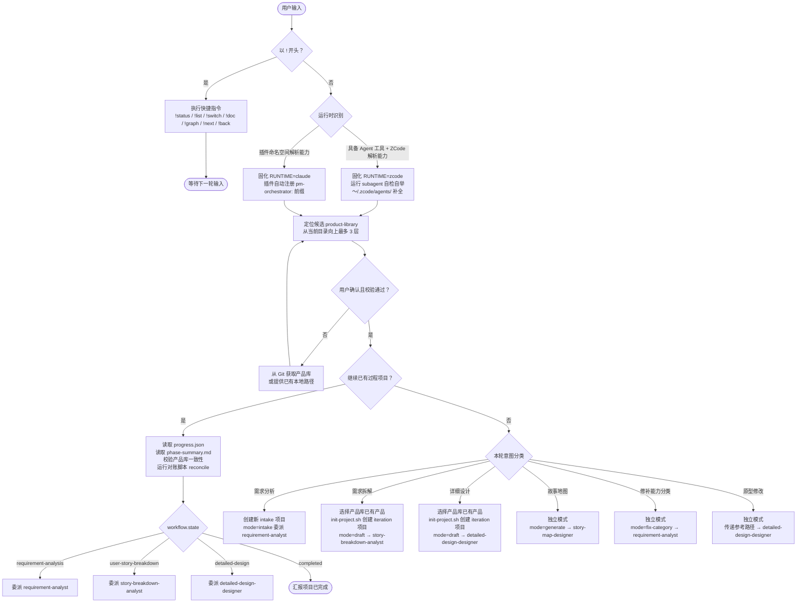
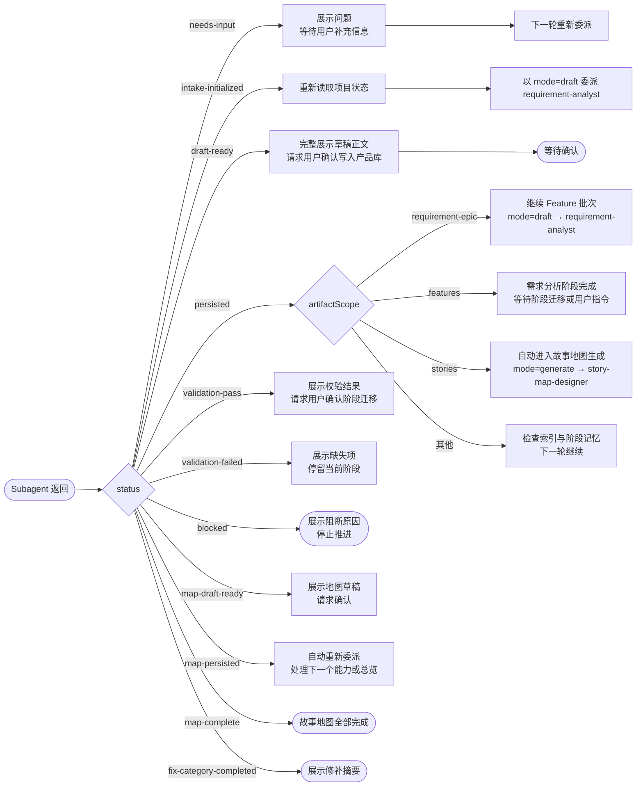
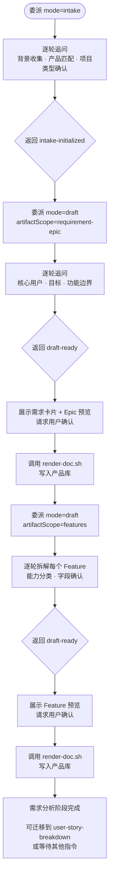
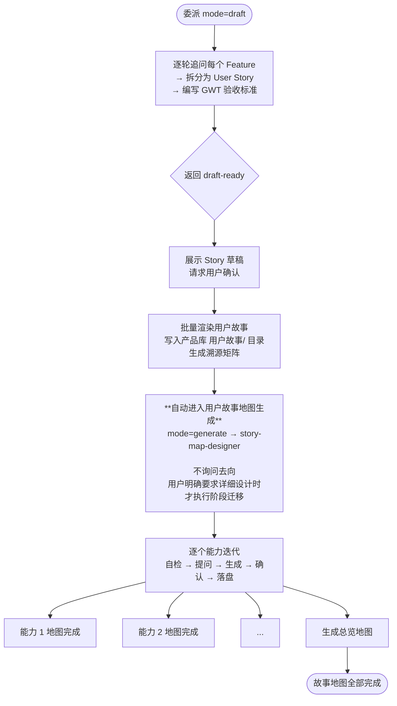
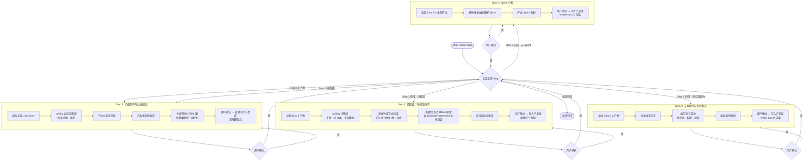
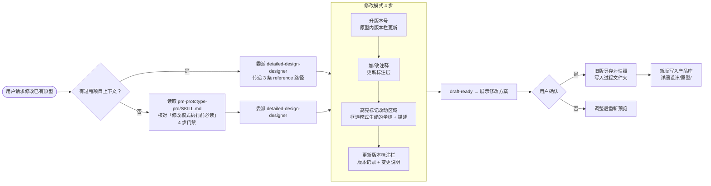

# pm-orchestrator

`pm-orchestrator` 是一套产品全流程设计 skill，**同时适配 Claude Code 与 ZCode**。它把产品设计工作拆成一个主调度 skill 和四个阶段 subagent：主调度器负责入口分流、项目恢复、产品库选择、阶段路由、用户确认和质量门；阶段 subagent 负责需求分析、需求拆解、详细设计和用户故事地图。

目标是把用户的模糊想法推进成可确认、可直接写入产品库、可追溯、可继续迭代的产品设计资产。

一份 skill 即插即用：同一个分发文件夹，装到 Claude Code 或 ZCode 的内容**逐字节一致**；运行时会话开始时识别宿主（`RUNTIME=claude` / `RUNTIME=zcode`），机制层自动切换，内容方法论共用。

---

## 架构总览：五层模型

```
┌─────────────────────────────────────────────────┐
│  ① 运行时识别层 (SKILL.md + runtime/)            │
│  会话开始 → 识别宿主 → 固化 RUNTIME              │
├─────────────────────────────────────────────────┤
│  ② 主 Skill 层 (SKILL.md)                       │
│  入口分流 · 产品库校验 · 项目状态 · 阶段路由      │
├─────────────────────────────────────────────────┤
│  ③ Agent 层 (agents/*.md)                       │
│  requirement-analyst                             │
│  story-breakdown-analyst                         │
│  detailed-design-designer                        │
│  story-map-designer                              │
├─────────────────────────────────────────────────┤
│  ④ Reference 层 (references/)                    │
│  阶段方法论 · 模板 · 质量门 · 共享追溯模型        │
├─────────────────────────────────────────────────┤
│  ⑤ 工具层 (scripts/ + project-template/)         │
│  项目骨架 · 机械校验 · 产品库规范                │
└─────────────────────────────────────────────────┘
```

---

## 核心调用流程图

### 一、主调度流程（入口 → 委派 → 返回）



### 二、Subagent 返回状态路由（谁回来 → 做什么）



### 三、需求分析阶段（requirement-analyst）



### 四、需求拆解阶段（story-breakdown-analyst）



### 五、详细设计阶段（detailed-design-designer）—— 四步路由



### 六、独立模式：用户故事地图生成

```mermaid
flowchart LR
    Trigger[触发条件] --> T1[需求拆解落盘完成 → 自动进入]
    Trigger --> T2[用户明确要求"生成故事地图"]
    
    T1 --> SM
    T2 --> SM

    subgraph SM[故事地图生成流程]
        direction LR
        P1[Phase 1<br/>逐个能力迭代] --> P2[Phase 2<br/>生成总览]
        
        subgraph PerCapability[每个能力的迭代]
            Read[读取能力文档] --> Analysis[自我分析<br/>必返回 needs-input]
            Analysis --> ShowAnalysis[展示自检结论 + 提问]
            ShowAnalysis --> ConfirmAnalysis[用户确认方向]
            ConfirmAnalysis --> GenerateMap[生成能力地图草案]
            GenerateMap --> ShowMapPreview[展示地图预览<br/>map-draft-ready]
            ShowMapPreview --> PersistMap[用户确认 → 落盘<br/>map-persisted]
        end

        PerCapability --> Next[自动扫描 → 下一个能力]
        Next --> PerCapability
        Next -->|全部能力完成| P2
    end

    P2 --> MapDone([map-complete])
```

### 七、独立模式：原型修改路由



---

## 版本历史

| 版本 | 日期 | 说明 |
|------|------|------|
| V4.0.0 | 2026-08-21 | 支持 zcode 使用，完成详细设计 step1+step2，可生成原型 |
| V4.0.1 | 2026-08-21 | 修复产品库命名和 obsidian 引用格式 |

---

## 安装与更新

仓库地址：[github.com/Tiger0521/pm-orchestrator](https://github.com/Tiger0521/pm-orchestrator)

### 首次安装（拷文件夹即用）

**两种宿主都只要把整个 skill 文件夹拷到对应的 skills 目录，重启即可用。**

- **Claude Code**：把整个 `pm-orchestrator/` 文件夹拷到 `~/.claude/skills/pm-orchestrator`。目录自带 `.claude-plugin/plugin.json`，Claude 重启后自动把它识别为插件，`agents/` 下的 4 个 agent 自动获得 `pm-orchestrator:` 命名空间。
- **ZCode**：把整个 `pm-orchestrator/` 文件夹拷到 `~/.zcode/skills/pm-orchestrator`。ZCode 不扫描 skill 文件夹内的 agent 文件，所以 **每次运行本 skill 时自动自检自举**，把 `agents/zcode/` 的 4 个 `.md` 中缺失者自动补到 `~/.zcode/agents/`。

`install.ps1` 是**可选**便捷工具（用于预置 subagent、做干净的整包重装），不是必需步骤。

### 更新

```powershell
git pull --ff-only origin main
powershell -ExecutionPolicy Bypass -File .\install.ps1 -Target claude   # 或 -Target zcode
```

拉取后重装，重启目标客户端即可生效。

---

## 目录结构

```
pm-orchestrator/                          ← git 仓库 = skill 本体（SKILL.md 在根）
├── SKILL.md                              ← 主调度入口 + 运行时识别门
├── README.md
├── install.ps1                           ← 统一安装脚本
│
├── references/                           ← 阶段方法论（双平台共用）
│   ├── orchestrator/                     ← 主调度器操作协议
│   │   ├── operations.md                 ← 委派、返回、记忆协议
│   │   ├── output-format.md              ← 输出规范
│   │   ├── phase-transition.md           ← 阶段迁移
│   │   ├── product-library-context.md    ← 产品库确认流程
│   │   └── shortcut-commands.md          ← ! 快捷键
│   ├── product-library/
│   │   └── contract.md                   ← 产品库契约
│   ├── shared/
│   │   └── traceability-model.md         ← 共享追溯模型
│   ├── requirement-analysis/             ← 需求分析方法论
│   ├── user-story-breakdown/             ← 需求拆解方法论
│   ├── detailed-design/                  ← 详细设计方法论
│   │   ├── instruction.md                ← 整体调度 + 4 步路由
│   │   ├── shared/                       ← 跨 Step 共享机制
│   │   │   ├── grilling-protocol.md      ← 问答协议
│   │   │   ├── confirmation-method.md    ← 确认流程
│   │   │   ├── design-review.md          ← 设计审查五维度
│   │   │   ├── output-contract.md        ← 产出字段契约
│   │   │   ├── persist-guide.md          ← 落盘轨道
│   │   │   ├── design-writing.md         ← 设计写作规范
│   │   │   ├── checklist.md              ← 质量门清单
│   │   │   ├── scale-adaptation.md       ← 规模自适应
│   │   │   ├── templates/                ← 渲染模板
│   │   │   └── examples/                 ← 质量示例
│   │   ├── step1-功能架构与动线规划/      ← 业务流 → 页面映射 → HTML 图
│   │   ├── step2-原型设计与规范对齐/      ← 交互式 HTML 原型 + 标注层
│   │   │   ├── workflow.md               ← 执行流程
│   │   │   ├── prototype-method.md       ← 原型方式 + 局部迭代
│   │   │   ├── annotation-overlay.md     ← 内联标注层规范
│   │   │   ├── ui-design-style.md        ← 设计系统 + 风格预设
│   │   │   ├── ui-style-presets/         ← 20+ 套 UI 风格预设
│   │   │   └── pm-prototype-prd/         ← 自包含内嵌技能
│   │   ├── step3-交互规则与边界补全/
│   │   └── step4-Sprint分解/
│   └── story-map/                        ← 用户故事地图方法论
│
├── runtime/
│   ├── claude.md                         ← Claude Code 机制层
│   └── zcode.md                          ← ZCode 机制层
│
├── agents/
│   ├── requirement-analyst.md            ← Claude Code 版（平铺）
│   ├── story-breakdown-analyst.md
│   ├── detailed-design-designer.md
│   ├── story-map-designer.md
│   └── zcode/                            ← ZCode 版
│       ├── requirement-analyst.md
│       ├── story-breakdown-analyst.md
│       ├── detailed-design-designer.md
│       └── story-map-designer.md
│
├── scripts/                              ← 机械校验、渲染、产品库工具
│   ├── render-doc.sh                     ← 从字段 JSON 渲染并写入产品库
│   ├── render-story.sh                   ← 批量渲染用户故事
│   ├── validate-phase.sh                 ← 阶段产物校验
│   ├── validate-product-library.sh       ← 产品库全量校验
│   ├── product-library-tools.mjs         ← 对账工具
│   ├── transition-project-state.sh       ← 原子更新 workflow.state
│   └── ...
│
└── project-template/                     ← 过程项目骨架
    ├── progress.json
    ├── refs.json
    ├── facts.json
    ├── phase-summary.md
    ├── decision-log.md
    └── tracking-log.md
```

---

## 运行时机制对比

| 项目 | Claude Code (RUNTIME=claude) | ZCode (RUNTIME=zcode) |
|------|------|------|
| Subagent 来源 | `agents/` 平铺，插件自动识别 | `agents/zcode/` 分发 → 自检自举到 `~/.zcode/agents/` |
| 委派方式 | 命名子 agent：`pm-orchestrator:<name>` | Agent 工具：`subagent_type=<裸名>` |
| 项目根 | `<workspace>/.claude/product-design-projects/` | 统一同上 |
| Reference 解析 | 相对 skillPath，subagent 在插件上下文内直接解析 | 经 `${skillPath}` 拼接 |
| Subagent tools | `Read Write Grep Glob LS Bash` | 同左 |
| 安装步骤 | 拷文件夹即可 + `.claude-plugin/plugin.json` 自动注册 | 拷文件夹即可，其余每次运行时自举 |

---

## 阶段制品落点

| 阶段 | 制品 | 落点 |
|------|------|------|
| 需求分析 | 需求卡片、Epic、Feature | 产品库 `<产品名>/` |
| 需求拆解 | User Story、GWT | 产品库 `<产品名>/用户故事/` |
| 需求拆解 | 溯源矩阵 | 过程项目 `docs/requirement-analysis/` |
| 详细设计 Step 1 | 业务流文档、页面映射、HTML 图 | 产品库 `详细设计/结构与流程图/` |
| 详细设计 Step 2 | 交互式 HTML 原型（含标注层） | 产品库 `详细设计/原型/` |
| 详细设计 Step 3 | 交互契约、规则摘要 | 产品库 `详细设计/`（render-doc.sh 渲染） |
| 详细设计 Step 4 | Sprint 规划 | 产品库 `详细设计/`（render-doc.sh 渲染） |
| 用户故事地图 | 能力地图、总览地图 | 产品库 `用户故事地图/` |

---

## 快捷指令

| 指令 | 作用 |
|------|------|
| `!status` | 查看当前项目进度、当前阶段、最近文档 |
| `!list` | 列出当前工作区下的产品设计项目 |
| `!switch <project-id>` | 切换到指定项目 |
| `!doc <doc-id>` | 读取并展示指定文档 |
| `!next` | 校验并推进到下一阶段（需用户确认） |
| `!back` | 回退上一阶段（需用户确认） |
| `!graph` | 展示当前项目文档引用关系 |

---

## 关键脚本

| 脚本 | 作用 |
|------|------|
| `scripts/prepare-intake.sh` | 创建 intake 目录和最小 `progress.json` |
| `scripts/init-project.sh` | 合并项目模板，初始化正式项目记忆 |
| `scripts/render-doc.sh` | 从字段 JSON 渲染需求卡片/设计文档/能力文档并直接写入产品库 |
| `scripts/render-story.sh` | 从 Story JSON 批量渲染用户故事并写入 `用户故事/` |
| `scripts/render-matrix.sh` | 从矩阵 JSON 渲染溯源矩阵 Markdown |
| `scripts/transform-project-state.sh` | 原子更新 `workflow.state`，只允许合法相邻迁移 |
| `scripts/validate-phase.sh` | 校验阶段产物和 frontmatter |
| `scripts/validate-product-library.sh` | 全量校验产品库（中文目录、命名、frontmatter、文件唯一性、链接完整性） |
| `scripts/product-library-tools.mjs` | 产品库对账（SHA-256 比对 `refs.json` 输出变更报告） |
| `scripts/acquire-product-library.sh` | 从 Git 仓库克隆或更新产品库 |
| `scripts/rename-product.sh` | 预览或应用产品简称变更，失败自动回滚 |
| `scripts/backfill-library-ids.mjs` | 旧项目迁移：为已落盘文档回填继承式产品库 ID |
| `scripts/export-doc-index.sh` | 导出文档索引或 Mermaid 引用图 |

---

## 产品库说明

产品库是主调度器每次运行前必须确认的容器目录。自动发现规则：从当前目录向上最多 3 层查找 `product-library/`。

产品库包含：
- **架构设计文档**：根标识，唯一匹配 `^.+架构设计\.md$`，含 5 个章节（建设背景、目标、设计原则、总体架构图、产品矩阵）
- **产品目录**：按产品全名命名的中文目录
- **能力文档 / 需求卡片 / Epic / Feature / 用户故事**：按名称和能力路径组织

产品库兼容 Obsidian 链接语法（`[[文件名]]`），也支持文件管理器直接浏览。

---

## 设计原则

- 主调度器只做流程管理，不替代阶段 agent 做专业分析。
- 每次只推进一个阶段，每轮只问一个主要问题。
- 草稿先确认，确认后直接写入产品库，落盘只有一次；过程空间只保留草稿态数据和项目记忆。
- 委派时传路径和状态，不复制大段产品库正文。
- 产品匹配渐进披露，不一次性读取全量产品库。
- 所有正式文档带产品库 frontmatter（`id`、`product`、`type`、`capability`、`aliases`、`tags`），并通过 `refs.json` 建立追溯关系。
- `workflow.state` 是当前阶段的权威状态字段。
- `iteration`/`refactor` 项目不得修改已有产品库产物，只能引用、扩展或重新设计。
- 详细设计 4 个 Step 之间有严格因果关系：Step 1 → Step 2 → Step 3 → Step 4，不允许跳过。
- 原型修改必须先升版本号、加注释、高亮标记、更新版本栏；旧版本另存为快照。
