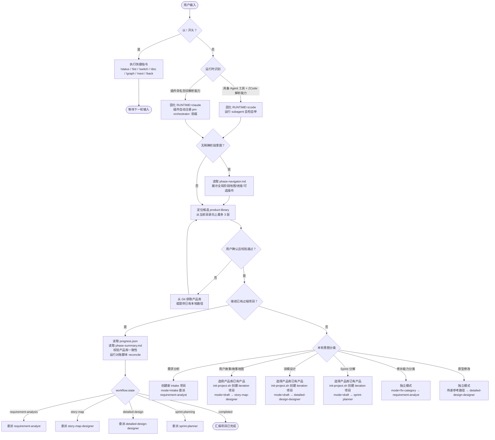
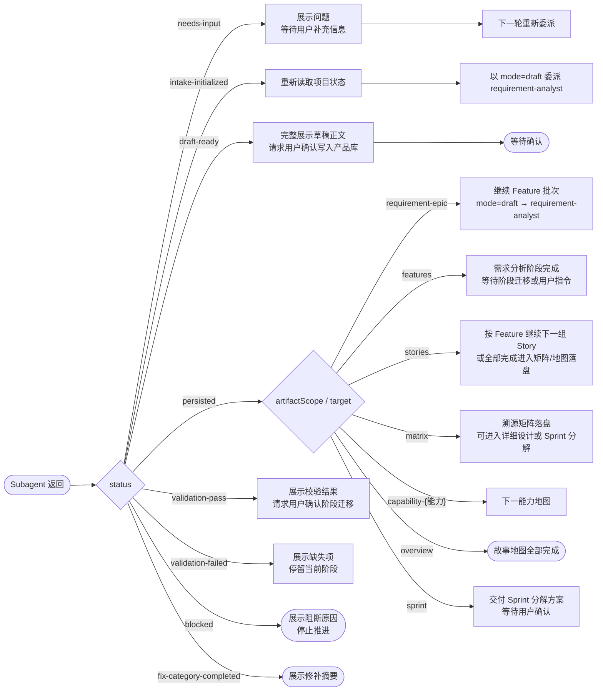
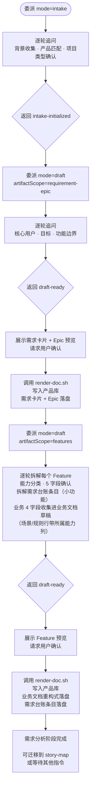
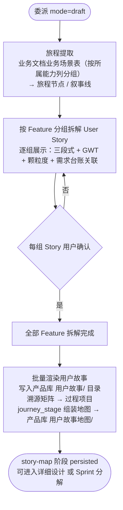
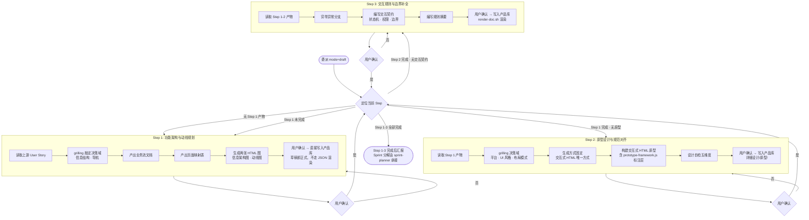
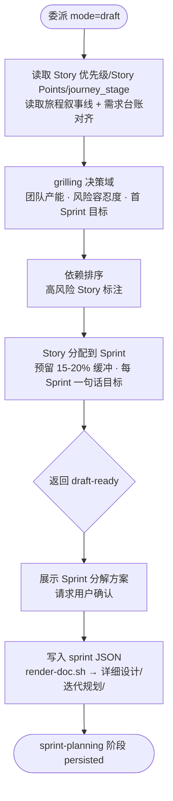
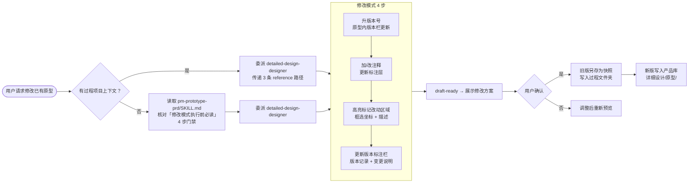

# pm-orchestrator

产品全流程设计主调度器。把模糊的产品想法，推进为已确认、可直接写入产品库、可追溯、可继续迭代的产品设计资产。

**一句话**：你说一个想法，它帮你完成从需求分析到 Sprint 分解的全流程。

---

## 一、工作流程概览

使用 `pm-orchestrator` 会经历以下几个流程。理解这些流程，你就知道什么时候该做什么、什么时候流程会走完。

### 前置依赖：产品库

**使用本 skill 前，你需要先有一个产品库。** 产品库是存放产品设计文档的目录，包含产品目录、需求文档、设计文档等。没有产品库，skill 无法工作。

产品库的获得方式：
- 从 Git 远程仓库克隆
- 使用你已有的本地产品库路径
- skill 会自动从当前目录向上最多 3 层查找 `product-library/`

### 流程一：需求分析

**入口**：用户说"我想做个产品"、"帮我梳理需求"

**过程**：主调度器 → 委派 `requirement-analyst` → 逐轮追问（背景、用户、功能） → 产出需求卡片 + Epic → 用户确认 → 写入产品库 → 继续拆解 Feature（每个能力拆 2-N 条**需求台账条目**）+ **业务文档** → 全部写入产品库

**结束标志**：需求卡片、Epic、所有 Feature、需求台账和业务文档均已写入产品库。此时可进入"用户故事+故事地图"阶段。

### 流程二：用户故事 + 故事地图

**入口**：需求分析完成后，用户提出继续拆解用户故事

**过程**：主调度器 → 委派 `story-map-designer` → **一次委派内完成**：旅程提取（从业务文档业务场景表按「所属能力」列分组推导旅程叙事线）→ 按 Feature 逐个确认 User Story（三段式 + GWT + 细颗粒度 + 关联需求台账条目）→ 从已确认 Story 的 `journey_stage` 逐个组装能力级地图 → 落盘：Story 写入产品库 `用户故事/`、溯源矩阵留在过程项目、地图写入产品库 `用户故事地图/`

**结束标志**：所有 Story、溯源矩阵、旅程叙事线和故事地图均已持久化并经用户确认。**此时可选择进入"详细设计"或"Sprint 分解"**，两者可并行或前后执行。

### 流程三：详细设计（三步）

**入口**：用户故事阶段完成后，用户提出继续详细设计

**过程**：主调度器 → 委派 `detailed-design-designer` → 按 Step 1→2→3 顺序推进，每个 Step 完成后经用户确认才进入下一步：

| Step | 做什么 | 产出 |
|------|--------|------|
| **Step 1** 功能架构与动线规划 | grilling 决策域 → 业务流文档 → 页面映射表 → 两张 HTML 图 | 产品库 `详细设计/结构与流程图/` |
| **Step 2** 原型设计与规范对齐 | 确定平台/UI风格 → 生成交互式 HTML 原型（含标注层） → 设计自检 | 产品库 `详细设计/原型/` |
| **Step 3** 交互规则与边界补全 | 穷举异常分支 → 交互契约（状态机/权限/边界） → 规则摘要 | 产品库 `详细设计/` |

**结束标志**：Step 1-3 全部完成并经用户确认。Sprint 分解属独立 `sprint-planning` 阶段，由主调度器另行委派。

### 流程四：Sprint 分解（独立阶段）

**入口**：用户故事阶段完成后，用户提出排 Sprint / 做迭代规划

**过程**：主调度器 → 委派 `sprint-planner` → 读取 Story 优先级 / Story Points / 依赖 / 旅程连贯性 → grilling 决策域（团队产能、风险容忍度、首 Sprint 目标）→ 依赖排序 → 把 Story 分配到 Sprint（预留 15-20% 缓冲）→ 每 Sprint 一句话目标 → 用户确认 → 落盘产品库 `详细设计/迭代规划/`

**结束标志**：迭代规划已持久化并经用户确认。全部阶段完成后项目可收尾。

### 流程五：原型修改（独立模式）

**入口**：用户对已有交互式 HTML 原型提出修改请求

**过程**：主调度器 → 委派 `detailed-design-designer` → 升版本号 → 加/改注释 → 高亮标记 → 更新版本栏 → 旧版另存为快照 → 新版写入产品库

**结束标志**：修改后的原型文件写入产品库。不改变阶段状态。

### 流程六：修补产品库能力分类（独立模式）

**入口**：用户说"修补产品库能力分类"、"重新归类能力"

**过程**：主调度器 → 以 `fix-category` 模式委派 `requirement-analyst` → 操作产品库能力文档

**结束标志**：能力分类修补完成。不涉及过程项目，不改变阶段状态。

### 无明确意图时：阶段导航

用户进入 skill 但**没有明确阶段意图**时，主调度器读取 `references/phase-navigator.md`，展示全局阶段地图（需求分析 → 能力划分 → 用户故事+故事地图 → 详细设计 → Sprint 分解）、当前进度与可选操作，并推荐从当前阶段继续。每次委派前，主调度器把「当前阶段 + 进度」注入 handoff context；各阶段开始时输出阶段简介与预期产出，结束时输出完成确认与下一步建议。

---

## 二、安装与更新

仓库地址：[github.com/Tiger0521/pm-orchestrator](https://github.com/Tiger0521/pm-orchestrator)

### 首次安装（拷文件夹即用）

**两种宿主都只要把整个 skill 文件夹拷到对应的 skills 目录，重启即可用。**

- **Claude Code**：把整个 `pm-orchestrator/` 文件夹拷到 `~/.claude/skills/pm-orchestrator`。目录自带 `.claude-plugin/plugin.json`，Claude 重启后自动识别为插件，`agents/` 下的 4 个 agent 自动获得 `pm-orchestrator:` 命名空间。
- **ZCode**：把整个 `pm-orchestrator/` 文件夹拷到 `~/.zcode/skills/pm-orchestrator`。ZCode 不扫描 skill 文件夹内的 agent 文件，每次运行本 skill 时自动自检自举，把 `agents/zcode/` 中缺失的 agent 补到 `~/.zcode/agents/`。

`install.ps1` 是**可选**便捷工具（用于预置 subagent、做干净的整包重装），不是必需步骤。

### 更新

```powershell
git pull --ff-only origin main
powershell -ExecutionPolicy Bypass -File .\install.ps1 -Target claude   # 或 -Target zcode
```

拉取后重装，重启目标客户端即可生效。

### 安装结果

安装后，最终在目标宿主上得到一致结构：

1. **skill 本体**：`SKILL.md`、`references/`、`runtime/`、`agents/`、`scripts/`、`project-template/` 放进目标宿主 skills 目录
2. **subagent 落点**：
   - Claude Code：无需投递——`.claude-plugin/plugin.json` 自动注册
   - ZCode：由 skill **每次运行时自检**，自动补齐到 `~/.zcode/agents/`

### 版本历史

| 版本 | 日期 | 说明 |
|------|------|------|
| V4.1.0 | 2026-08-27 | 阶段重构：`user-story-breakdown` 更名 `story-map` 并合并地图生成；Sprint 分解独立为 `sprint-planning` 阶段（新增 `sprint-planner`）；需求台账 + 业务文档 + Feature 12→5 字段；新增阶段导航器与 `phase_status` |
| V4.0.2 | 2026-08-21 | 更新 README：补充完整调用关系流程图 |
| V4.0.1 | 2026-08-21 | 修复产品库命名和 obsidian 引用格式 |
| V4.0.0 | 2026-08-21 | 支持 zcode 使用，完成详细设计 step1+step2，可生成原型 |

---

## 三、目录结构

```
pm-orchestrator/                          ← git 仓库根 = skill 本体
│
├── SKILL.md                              ← 主调度入口 + 运行时识别门 + 阶段导航
├── README.md
├── .gitignore
├── install.ps1                           ← 统一安装脚本（可选）
├── .claude-plugin/
│   └── plugin.json                       ← Claude Code 插件注册
│
├── runtime/                              ← 运行时机制层
│   ├── claude.md                         ← Claude Code 机制（命名/项目根/路径解析）
│   └── zcode.md                          ← ZCode 机制（自检自举/Agent 工具/路径解析）
│
├── agents/                               ← Subagent 定义
│   ├── requirement-analyst.md            ← Claude Code 版（平铺，插件自动命名空间）
│   ├── story-map-designer.md             ← 旅程 + User Story + 故事地图（一次完成）
│   ├── detailed-design-designer.md       ← Step 1-3 详细设计（Sprint 分解不在此）
│   ├── sprint-planner.md                 ← Sprint 分解（独立阶段）
│   └── zcode/                            ← ZCode 版（分发副本）
│       ├── requirement-analyst.md
│       ├── story-map-designer.md
│       ├── detailed-design-designer.md
│       └── sprint-planner.md
│
├── references/                           ← 方法论、模板、质量门（双平台共用）
│   │
│   ├── phase-navigator.md                ← 全局阶段地图 + 状态检测 + 导航输出格式
│   │
│   ├── orchestrator/                     ← 主调度器操作协议
│   │   ├── operations.md                 ← 委派、返回、记忆、安全协议
│   │   ├── output-format.md              ← 输出规范
│   │   ├── phase-transition.md           ← 阶段迁移规则
│   │   ├── product-library-context.md    ← 产品库确认流程
│   │   └── shortcut-commands.md          ← ! 快捷指令
│   │
│   ├── orchestrator-operations.md        ← 共享操作协议主文件
│   │
│   ├── product-library/
│   │   └── contract.md                   ← 产品库契约（命名/frontmatter/层级/链接）
│   │
│   ├── shared/
│   │   └── traceability-model.md         ← 共享追溯模型
│   │
│   ├── requirement-analysis/             ← 需求分析阶段
│   │   ├── instruction.md                ← 整体指令
│   │   ├── guides/                       ← 方法论指南
│   │   │   ├── checklist.md              ← 质量门清单
│   │   │   ├── evidence-and-input.md     ← 证据与输入
│   │   │   ├── product-matching.md       ← 产品匹配
│   │   │   ├── capability-classification.md  ← 能力分类
│   │   │   ├── quality-and-interaction.md    ← 质量与交互
│   │   │   └── question-bank.md          ← 问题库
│   │   ├── workflows/                    ← 工作流
│   │   │   ├── intake.md                 ← 新需求受理
│   │   │   ├── draft.md                  ← 需求分析草稿（含需求台账/业务文档草稿）
│   │   │   ├── persist.md                ← 写入产品库（含台账/业务文档落盘）
│   │   │   ├── diagnostic.md             ← 诊断
│   │   │   └── fix-category.md           ← 修补能力分类
│   │   ├── templates/                    ← 模板
│   │   │   ├── requirement-card.md
│   │   │   ├── epic.md
│   │   │   ├── feature.md                ← 5 字段（业务 4 字段迁至业务文档）
│   │   │   ├── requirement-ledger.md     ← 需求台账
│   │   │   ├── business-doc.md           ← 业务文档（扁平 4 字段）
│   │   │   ├── diagnostic-report.md
│   │   │   └── alternative-options.md
│   │   └── writing-paradigm/             ← 写作范式
│   │       ├── general-rules.md
│   │       ├── requirement-card.md
│   │       ├── epic.md
│   │       ├── feature.md
│   │       ├── requirement-ledger.md
│   │       └── business-doc.md
│   │
│   ├── story-map/                        ← 用户故事 + 故事地图阶段（合并）
│   │   ├── instruction.md                ← 整体指令（阶段内一次完成）
│   │   ├── workflow.md                   ← 合并工作流（旅程→Story→地图→落盘）
│   │   ├── grilling-protocol.md          ← 追问协议（含颗粒度/需求覆盖度）
│   │   ├── confirmation-method.md        ← 确认方法
│   │   ├── core-mechanisms.md            ← 核心机制（INVEST/GWT/细颗粒度）
│   │   ├── checklist.md                  ← 质量门
│   │   ├── output-contract.md            ← 产出契约（含 journey_stage/需求台账关联）
│   │   ├── persist-guide.md              ← 落盘指南
│   │   ├── guides/
│   │   │   ├── journey-extraction.md     ← 旅程提取
│   │   │   ├── story-placement.md
│   │   │   └── walking-skeleton.md
│   │   ├── templates/
│   │   │   ├── user-story.md
│   │   │   ├── traceability-matrix.md
│   │   │   └── capability-map.md
│   │   ├── writing-paradigm/
│   │   │   ├── user-story-writing.md
│   │   │   └── map-writing.md
│   │   └── examples/
│   │       └── model-config-stories.md
│   │
│   ├── detailed-design/                  ← 详细设计阶段（Step 1-3）
│   │   ├── instruction.md                ← 整体调度 + 3 步路由
│   │   ├── shared/                       ← 跨 Step 共享机制
│   │   │   ├── upstream-quality-gate.md  ← 上游质量门
│   │   │   ├── grilling-protocol.md      ← 问答协议（3.4/4.4 Sprint 决策域由 sprint-planning 复用）
│   │   │   ├── confirmation-method.md    ← 确认流程
│   │   │   ├── design-review.md          ← 设计审查五维度
│   │   │   ├── persist-guide.md          ← 落盘轨道（sprint JSON 由 sprint-planning 复用）
│   │   │   ├── output-contract.md        ← 产出字段契约
│   │   │   ├── design-writing.md         ← 设计写作规范
│   │   │   ├── checklist.md              ← 质量门清单
│   │   │   ├── scale-adaptation.md       ← 规模自适应
│   │   │   ├── templates/                ← render-doc.sh 渲染模板
│   │   │   │   ├── structure-flow.md
│   │   │   │   ├── prototype.md
│   │   │   │   ├── interaction-contract.md
│   │   │   │   ├── rules-summary.md
│   │   │   │   └── sprint.md             ← sprint-planning 落盘迭代规划时复用
│   │   │   └── examples/
│   │   │       └── model-config-design.md
│   │   │
│   │   ├── step1-功能架构与动线规划/      ← Step 1
│   │   │   ├── workflow.md
│   │   │   ├── business-flow-writing.md
│   │   │   ├── page-mapping.md
│   │   │   └── html-diagram.md
│   │   │
│   │   ├── step2-原型设计与规范对齐/      ← Step 2
│   │   │   ├── workflow.md
│   │   │   ├── prototype-method.md
│   │   │   ├── annotation-overlay.md
│   │   │   ├── ui-design-style.md
│   │   │   ├── ui-style-presets/          ← 20+ 套 UI 风格预设
│   │   │   │   ├── README.md
│   │   │   │   ├── admin-backend-{dark,industrial,minimal}.md
│   │   │   │   ├── mini-program-{chinese,pastel}.md
│   │   │   │   ├── mobile-app-{art-deco,glassmorphism,material,pastel,vibrant}.md
│   │   │   │   ├── web-app-{gradient,industrial,minimal}.md
│   │   │   │   ├── web-dashboard-{dark,industrial,minimal,retro,zen}.md
│   │   │   │   └── web-landing-{brutalist,chinese,luxury,magazine}.md
│   │   │   └── pm-prototype-prd/          ← 内嵌子技能：交互式 HTML + 标注引擎
│   │   │       ├── SKILL.md
│   │   │       ├── assets/
│   │   │       │   └── prototype-framework.js
│   │   │       └── references/
│   │   │           ├── prototype-guide.md
│   │   │           └── prd-template.md
│   │   │
│   │   └── step3-交互规则与边界补全/
│   │       └── workflow.md
│   │
│   ├── sprint-planning/                  ← Sprint 分解阶段（独立）
│   │   ├── instruction.md                ← 整体指令
│   │   └── workflow.md                   ← 执行流程（含规模自适应）
│   │
│   └── vendor/                           ← 第三方工具
│       └── archify/                      ← 架构图渲染工具
│           ├── SKILL.md
│           ├── bin/
│           ├── renderers/
│           ├── schemas/
│           ├── references/
│           ├── examples/
│           ├── test/
│           ├── brand-marks/
│           ├── delta/
│           └── recipes/
│
├── scripts/                              ← 工具脚本
│   ├── 项目初始化
│   │   ├── prepare-intake.sh             ← 创建 intake 目录 + progress.json
│   │   └── init-project.sh               ← 合并项目模板，初始化项目
│   │
│   ├── 渲染与落盘
│   │   ├── render-doc.sh                 ← 字段 JSON → 产品库文档
│   │   ├── render-story.sh               ← Story JSON → 用户故事
│   │   ├── render-matrix.sh              ← 矩阵 JSON → 溯源矩阵
│   │   └── quick-persist.sh              ← 快速渲染 Markdown
│   │
│   ├── 校验
│   │   ├── validate-phase.sh             ← 阶段产物校验
│   │   ├── validate-phase.ps1            ← PowerShell 版
│   │   ├── validate-paradigm.sh          ← 写作范式校验
│   │   ├── validate-story.sh             ← 用户故事规范校验
│   │   ├── validate-product-library.sh   ← 产品库全量校验
│   │   └── validate-product-library-lite.sh  ← 产品库快速校验
│   │
│   ├── 产品库管理
│   │   ├── acquire-product-library.sh    ← Git 克隆/更新产品库
│   │   ├── product-library-tools.mjs     ← 对账工具（reconcile）
│   │   ├── backfill-library-ids.mjs      ← 回填继承式 ID
│   │   └── rename-product.sh             ← 产品简称变更
│   │
│   ├── 状态与迁移
│   │   ├── transition-project-state.sh   ← 原子更新 workflow.state
│   │   └── migrate-story-layout.ps1      ← Story 布局迁移
│   │
│   ├── 导出
│   │   ├── export-doc-index.sh           ← 文档索引/Mermaid 引用图
│   │   ├── export-doc-index.ps1          ← PowerShell 版
│   │   └── export-to-library.sh          ← 【已废弃】旧版导出
│   │
│   └── 其他
│       └── convert-document.py           ← Word/PPT/Excel → Markdown
│
└── project-template/                     ← 过程项目骨架
    ├── progress.json                     ← 项目名片 + workflow.state（含 phases 四阶段状态）
    ├── refs.json                         ← 文档节点 + 引用关系
    ├── facts.json                        ← 已确认结构化事实
    ├── phase-summary.md                  ← 跨会话恢复摘要（各阶段条目含 phase_status）
    ├── decision-log.md                   ← 决策记录
    └── tracking-log.md                   ← 假设、风险、未决问题
```

---

## 四、核心调用流程图

### 1. 主调度流程（总图）



### 2. Subagent 返回状态路由



### 3. 需求分析阶段



### 4. 用户故事 + 故事地图（一次委派完成）



### 5. 详细设计三步路由



### 6. Sprint 分解路由（独立阶段）



### 7. 原型修改路由（独立模式）



### 8. 运行时识别与委派对比

```mermaid
flowchart TD
    Start([会话开始]) --> Detect{识别宿主}
    Detect -->|是 Claude Code| Claude[固化 RUNTIME=claude]
    Detect -->|是 ZCode| ZCode[固化 RUNTIME=zcode]

    Claude --> ClaudeSub[委派方式<br/>命名子 Agent<br/>pm-orchestrator:<name>]
    Claude --> ClaudeRef[Reference 解析<br/>相对 skillPath<br/>插件上下文直接解析]
    Claude --> ClaudePlugin[插件注册<br/>.claude-plugin/plugin.json<br/>自动命名空间]

    ZCode --> ZCodeSub[委派方式<br/>Agent 工具<br/>subagent_type=<裸名>]
    ZCode --> ZCodeRef[Reference 解析<br/>经 ${skillPath} 拼接]
    ZCode --> ZCodeSelf[Subagent 来源<br/>每次运行时自检自举<br/>agents/zcode/ → ~/.zcode/agents/]

    ClaudeSub --> Same[两运行时共用一套<br/>方法论 references/<br/>项目根统一<br/>产品库契约统一]
    ZCodeSub --> Same
```

---

## 产品库

每次使用 skill 前，主调度器都会确认一个产品库。自动发现规则：从当前目录向上最多 3 层查找 `product-library/`。

### 产品库结构

```
product-library/
├── 架构设计.md                      ← 根标识文档（唯一匹配 ^.+架构设计\\.md$）
├── 产品A全名/                       ← 按产品全名命名的目录
│   ├── 简称-需求卡片.md              ← 需求卡片（继承式 ID）
│   ├── 简称-需求台账.md              ← 需求台账（六列表格，条目按小功能登记）
│   ├── 简称-业务文档.md              ← 业务文档（扁平 4 字段，场景/规则行带所属能力列）
│   ├── 简称-Epic1.md                 ← Epic 文档
│   ├── 简称-能力文档-能力名.md        ← 能力文档
│   ├── 简称-F001-功能名.md            ← Feature 文档（5 字段）
│   ├── 用户故事/
│   │   ├── 名称故事.md               ← User Story（含旅程阶段/需求台账关联）
│   │   └── ...
│   ├── 用户故事地图/
│   │   ├── 能力名-能力地图.md
│   │   └── ...
│   ├── 详细设计/
│   │   ├── 结构与流程图/
│   │   ├── 原型/
│   │   ├── 交互契约/
│   │   ├── 规则摘要/
│   │   └── 迭代规划/                 ← Sprint 分解产物
│   └── ...
└── 产品B全名/
    └── ...
```

- 产品目录使用全名，文件使用 2–6 个汉字的唯一简称前缀
- 正文使用 Wiki 链接 `[[文件名]]` 引用其他文档（兼容 Obsidian）；引用台账条目用 `[[<简称>-需求台账|<条目ID>]]` 文件链接（条目是台账表格中的一行，不使用块锚点）
- 所有文档带 frontmatter（`id`、`product`、`type`、`capability`、`aliases`、`tags`）
- 架构设计文档是根标识和最高产品设计标准

---

## 项目记忆

项目数据不写入 skill 目录，而是保存在当前工作区：

```
<workspace>/.claude/product-design-projects/<project-id>/
```

每个项目包含：

| 文件 | 作用 |
|------|------|
| `progress.json` | 项目名片、`workflow.state`、项目类型、产品库选择、四阶段状态（requirement-analysis / story-map / detailed-design / sprint-planning）和时间戳 |
| `refs.json` | 文档节点和引用关系图谱，含产品库 ID（`libraryId`）和内容哈希（`contentHash`） |
| `facts.json` | 已确认结构化事实 |
| `decision-log.md` | 决策、理由和被否定方案 |
| `tracking-log.md` | 假设、风险、未决问题 |
| `phase-summary.md` | 跨会话恢复摘要；每个阶段条目含 `phase_status`（draft/confirmed/persisted），供阶段导航器读取 |

正式文档目录：`docs/` 下存放草稿态数据（字段 JSON、Story/矩阵 JSON、设计 JSON）和追溯矩阵。

---

## 快捷指令

| 指令 | 作用 |
|------|------|
| `!status` | 查看当前项目进度、当前阶段、最近文档 |
| `!list` | 列出当前工作区下的产品设计项目 |
| `!switch <project-id>` | 切换到指定项目 |
| `!doc <doc-id>` | 读取并展示指定文档 |
| `!next` | 校验并推进到下一阶段（需用户确认） |
| `!back` | 回退上一阶段（需用户确认） |
| `!graph` | 展示当前项目文档引用关系 |

---

## 关键脚本速查

| 脚本 | 作用 |
|------|------|
| **项目初始化** | |
| `scripts/prepare-intake.sh` | 创建 intake 目录和最小 `progress.json` |
| `scripts/init-project.sh` | 合并项目模板，初始化项目（初始阶段支持 requirement-analysis / story-map / detailed-design / sprint-planning） |
| **写入产品库** | |
| `scripts/render-doc.sh` | 从字段 JSON 渲染需求卡片/设计文档/能力文档/迭代规划并直接写入产品库 |
| `scripts/render-story.sh` | 从 Story JSON 批量渲染用户故事并写入 `用户故事/` |
| `scripts/render-matrix.sh` | 从矩阵 JSON 渲染溯源矩阵 |
| **阶段迁移** | |
| `scripts/transition-project-state.sh` | 原子更新 `workflow.state`，只允许合法相邻迁移（6 前行 + 4 回退边） |
| **校验** | |
| `scripts/validate-phase.sh` | 校验阶段产物和 frontmatter（兼容旧 `user-story-breakdown` 别名） |
| `scripts/validate-product-library.sh` | 全量校验产品库 |
| `scripts/validate-product-library-lite.sh` | 快速校验产品库 |
| `scripts/validate-paradigm.sh` | 校验需求分析写作范式 |
| `scripts/validate-story.sh` | 校验用户故事写作规范 |
| **产品库管理** | |
| `scripts/acquire-product-library.sh` | 从 Git 仓库克隆或更新产品库 |
| `scripts/product-library-tools.mjs` | 对账工具（SHA-256 比对 + 变更报告） |
| `scripts/rename-product.sh` | 产品简称变更，失败自动回滚 |
| `scripts/backfill-library-ids.mjs` | 旧项目迁移：回填继承式 ID |

---

## 设计原则

- 主调度器只做流程管理，不替代阶段 agent 做专业分析。
- 每次只推进一个阶段，每轮只问一个主要问题。
- 草稿先确认，确认后直接写入产品库，落盘只有一次。
- 委派时传路径和状态，不复制大段产品库正文。
- 产品匹配渐进披露，不一次性读取全量产品库。
- 所有正式文档带产品库 frontmatter，通过 `refs.json` 建立追溯关系。
- `workflow.state` 是当前阶段的权威状态字段（`requirement-analysis → story-map → detailed-design / sprint-planning → completed`）。
- story-map 阶段内一次完成旅程提取 → Story 拆解 → 故事地图，不拆两次委派。
- 详细设计 3 个 Step 之间有严格因果关系（Step 1→2→3），不允许跳过；Sprint 分解属独立 `sprint-planning` 阶段。
- 原型修改必须先升版本号、加注释、高亮标记、更新版本栏；旧版另存为快照。
- `iteration`/`refactor` 项目不得修改已有产品库产物，只能引用、扩展或重新设计。