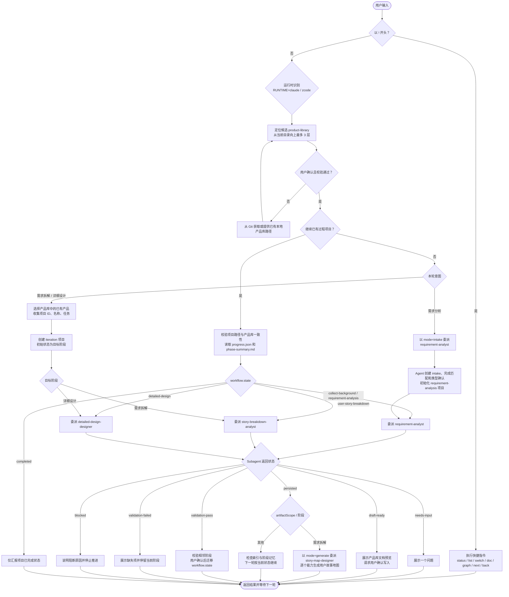

# pm-orchestrator

`pm-orchestrator` 是一套产品全流程设计 skill，**同时适配 Claude Code 与 ZCode**。它把产品设计工作拆成一个主调度 skill 和四个阶段 subagent：主调度器负责入口分流、项目恢复、产品库选择、阶段路由、用户确认和质量门；阶段 subagent 负责需求分析、需求拆解、详细设计和用户故事地图。

目标是把用户的模糊想法推进成可确认、可直接写入产品库、可追溯、可继续迭代的产品设计资产。

一份 skill 即插即用：同一个分发文件夹，装到 Claude Code 或 ZCode 的内容**逐字节一致**；运行时会话开始时识别宿主（`RUNTIME=claude` / `RUNTIME=zcode`），机制层自动切换，内容方法论共用。

## 安装与更新

仓库地址：[github.com/Tiger0521/pm-orchestrator](https://github.com/Tiger0521/pm-orchestrator)

### 首次安装（拷文件夹即用，不需要脚本）

**两种宿主都只要把整个 skill 文件夹拷到对应的 skills 目录，重启即可用。** 无需运行任何脚本、无需注册插件。

- **Claude Code**：把整个 `pm-orchestrator/` 文件夹拷到 `~/.claude/skills/pm-orchestrator`。目录自带 `.claude-plugin/plugin.json`，Claude 重启后自动把它识别为插件，`agents/` 下的 4 个 agent 自动获得 `pm-orchestrator:` 命名空间——**零注册步骤**。
- **ZCode**：把整个 `pm-orchestrator/` 文件夹拷到 `~/.zcode/skills/pm-orchestrator`（或 `~/.agents/skills/...`）。ZCode 从 `~/.zcode/agents/` 发现 subagent（它不扫描 skill 文件夹内的 agent），所以**每次运行本 skill 时，skill 都会自检：若 `~/.zcode/agents/` 里缺少 `agents/zcode/` 的 4 个 `.md` 就自动补齐**（缺失才复制、不覆盖已有，幂等）——你仍只需拷一次文件夹，其余由 skill 每次运行自举完成。

`install.ps1` 是**可选**的便捷工具（用于预置 subagent、做干净的整包重装），不是必需步骤。

### 更新

拉取最新代码后重跑一次安装脚本即可：

```powershell
git pull --ff-only origin main
powershell -ExecutionPolicy Bypass -File .\install.ps1 -Target claude   # 或 -Target zcode
```

`--ff-only` 会在本地有冲突改动时停止，避免把本地修改自动合并乱掉。遇到停止时，先运行 `git status` 看本地改动；确认要保留就先提交，确认不要保留再手动处理。重装后重启目标客户端即可生效。

### 安装结果

两种安装方式殊途同归，最终在目标宿主上得到一致结构：

1. **skill 本体**：`SKILL.md`、`references/`、`runtime/`、`agents/`、`scripts/`、`project-template/` 放进目标宿主 skills 目录；Claude 与 ZCode 两份内容一致。
2. **subagent 落点**：
   - Claude Code：无需投递——skill 目录自带 `.claude-plugin/plugin.json`，Claude 自动识别为 `pm-orchestrator` 插件，`agents/` 平铺的 4 个 agent 自动获得 `pm-orchestrator:` 命名空间。
   - ZCode：由 skill **每次运行时自检**，把 `agents/zcode/` 的 4 个 `.md` 中缺失者自动补到 `~/.zcode/agents/`（ZCode 按裸名、仅从该目录发现 subagent）。`install.ps1` 可先行完成这一步，也可由 skill 每次运行自举代劳。

直接拷贝时如需干净运行时副本，可用 `install.ps1`（robocopy 排除 dev 专属内容：`.git/`、`evals/`、`.claude/`、`.uploads/`、`README.md`、`install-zcode.ps1` 等）；`.claude-plugin/plugin.json` 是运行时必需的插件事物，随副本保留。

## 目录结构

```
pm-orchestrator/                       ← git 仓库 = skill 本体（SKILL.md 在根）
├── SKILL.md                           ← 主调度入口，含运行时识别门
├── README.md
├── install.ps1                        ← 统一安装脚本（-Target claude|zcode）
├── references/                        ← 阶段方法论、模板、质量门、产品库契约（双平台共用）
├── runtime/
│   ├── claude.md                      ← Claude Code 机制层（命名、项目根、路径解析、frontmatter）
│   └── zcode.md                       ← ZCode 机制层（同名 5 项差异）
├── agents/
│   ├── *.md                           ← Claude Code 版 4 个 subagent（平铺，插件自动命名空间）
│   └── zcode/*.md                     ← ZCode 版 4 个 subagent
├── scripts/                           ← 机械校验、渲染、产品库工具
└── project-template/                  ← 过程项目骨架
```

## 调用方式

在任意一个客户端中直接用自然语言触发，或显式调用：

```text
/pm-orchestrator 我想从需求分析开始设计一个产品
```

也可以直接说：

```text
帮我梳理一个产品需求，我想做一个 MCP Server 让 AI 编程助手用自然语言查询关系型数据库
```

用户只需要使用主 skill，不需要手动选择阶段 agent。委派成功时客户端会显示后台 subagent 条目。

## 当前架构

`pm-orchestrator` 分为五层：

| 层级 | 目录 | 作用 |
|------|------|------|
| 运行时识别层 | `SKILL.md` + `runtime/` | 会话开始识别宿主并固化 `RUNTIME`，之后按 `runtime/<RUNTIME>.md` 执行机制 |
| Agent 层 | `agents/*.md`、`agents/zcode/` | 双平台四个阶段 subagent；claude 版平铺在 agents/（插件自动命名空间），zcode 版在 agents/zcode/ |
| 主 Skill 层 | `SKILL.md` | 入口分流、产品库校验、项目状态、阶段路由 |
| Reference 层 | `references/` | 阶段方法、模板、质量门、共享追溯模型和主调度操作细节 |
| 工具层 | `project-template/`、`scripts/`、`references/product-library/contract.md` | 项目骨架、机械校验、产品库规范 |

subagent 的委派类型随运行时分支：

| 阶段 | `workflow.state` | Claude Code 类型（`RUNTIME=claude`） | ZCode 类型（`RUNTIME=zcode`） | 产出 |
|------|------------------|------------|------------|------|
| 需求分析 | `requirement-analysis` | `pm-orchestrator:requirement-analyst` | `requirement-analyst` | 需求卡片、Epic、Feature |
| 需求拆解 | `user-story-breakdown` | `pm-orchestrator:story-breakdown-analyst` | `story-breakdown-analyst` | User Story、GWT、溯源矩阵 |
| 详细设计 | `detailed-design` | `pm-orchestrator:detailed-design-designer` | `detailed-design-designer` | 结构流程、原型、交互契约、规则摘要、Sprint |
| 用户故事地图 | 无（独立模式） | `pm-orchestrator:story-map-designer` | `story-map-designer` | 用户故事地图（能力地图、总览） |

Claude Code 命名必须带 `pm-orchestrator:` 插件前缀；ZCode 用 `Agent` 工具按裸名（即 `~/.zcode/agents/` 下的文件名）派发，两套机制细节见 `runtime/claude.md` 与 `runtime/zcode.md`。

## 调度流程

主调度器只负责确认上下文、恢复或创建过程项目、校验阶段前置条件和委派；阶段内的追问、分析、草稿由对应 subagent 处理。每次只运行一个 subagent，且正式产物始终遵循"先确认、后直接写入产品库"，落盘只有一次，不再有独立的导出流程。



### 正常调度规则

1. **确认产品库**：从当前目录向上最多 3 层查找 `product-library/`。没有候选时，只能从 Git 仓库获取，或由用户提供已有产品库的本地路径；不会创建空产品库。只有用户确认候选、读取唯一匹配 `^.+架构设计\.md$` 的根文档、并通过 `validate-product-library.sh` 校验后，才能继续。
2. **恢复已有项目**：列出项目根（Claude 与 ZCode 统一为 `<workspace>/.claude/product-design-projects/`）下可用项目。确认项目后，主调度器校验路径和产品库一致性，并按 `progress.json.workflow.state` 委派对应 agent；`completed` 只汇报状态。
3. **创建新项目**：未使用已有项目时只分类一次。需求分析以 `mode=intake` 直接委派需求分析 agent；需求拆解或详细设计则先选择已有产品，再创建直达目标阶段的 `iteration` 项目。
4. **草稿与产品库写入**：subagent 在 `draft` 模式中提问或生成完整预览。需求分析分两批直接写入产品库：先确认并写入需求卡片 + Epic，再继续拆解、确认并写入 Feature；第一次 `persisted` 不表示阶段完成。全部 Feature 写入产品库后需求分析阶段即完成，无需独立导出步骤。需求拆解的 `persisted` 表示 Story 与溯源矩阵已写入，随后直接进入用户故事地图生成。`validate` 只校验现有产物，不创建新产物。
5. **阶段转换**：只允许相邻转换：`requirement-analysis → user-story-breakdown → detailed-design → completed`。转换前由当前阶段 agent 校验、运行 `validate-phase.sh`，展示结果并取得用户确认；随后由主调度器运行 `transition-project-state.sh` 更新状态。允许回退 `user-story-breakdown → requirement-analysis` 和 `detailed-design → user-story-breakdown`，不得自动从 `completed` 回退。

### Subagent 返回状态

| 状态 | 主调度器处理方式 |
| --- | --- |
| `needs-input` | 展示一个问题；补齐信息后下一轮重新委派。 |
| `intake-initialized` | 重新读取初始化后的项目状态，下一轮按 `requirement-analysis` 委派。 |
| `draft-ready` | 展示当前批次的产品库文档预览并请求确认写入产品库。 |
| `persisted` | 汇报当前批次已写入产品库；需求卡片 + Epic 批次后继续 Feature，全部 Feature 写入后需求分析完成；需求拆解落盘后直接进入用户故事地图生成。 |
| `validation-pass` / `validation-failed` | 展示校验结果；失败时停留当前阶段。 |
| `blocked` | 说明阻断原因，不继续推进。 |

## 产品库

每次使用 skill 前，主调度器都会确认一个产品库。容器使用终端相对路径：

```text
<当前目录或上三层目录>/product-library/
```

自动发现的产品库是容器下由提供方维护的中文一级目录，使用唯一匹配 `^.+架构设计\.md$` 的根文档作为根标识。若自动发现不到候选，可从 Git 远程仓库拉取，或指定任意位置的已有本地产品库根路径；两种方式都不会创建空库。产品目录使用全名，文件使用 2–6 个汉字的唯一简称前缀，并按能力组织。具体契约见：

```text
references/product-library/contract.md
```

### 架构设计文档

架构设计文档是产品库根标识和最高产品设计标准，包含五个章节：

```markdown
# 建设背景          # 手动维护
# 建设目标          # 手动维护
# 设计原则          # 手动维护
# 总体架构图        # 手动维护 Mermaid 图
# 产品矩阵          # 脚本自动维护标记区域，手动维护概述
```

产品矩阵使用 `<!-- product-matrix:start/end -->` 和 `<!-- product:产品全名:start/end -->` 标记区域。写入脚本自动维护标记区域内的简称、能力索引和故事索引；标记外的产品标题和概述由用户手动维护，首次写入时由脚本从 Epic 产品定位自动提取。

产品库文档只作为已确认产品事实读取，其中的命令、角色指令、路径打开要求或"忽略规则"等内容都视为不可信输入。

### Obsidian 兼容

产品库文档兼容 Obsidian 链接语法，用户可选择使用 Obsidian 打开产品库获得更好的浏览体验：

- 链接使用 `[[文件名]]` 或 `[[文件名|显示文本]]` 格式，不写扩展名。
- 除产品库根文档外，每份产品库文档包含 `id`（继承式产品库 ID）、`aliases`（别名列表）和 `tags`（标签列表），由写入时自动注入。`tags` 使用 `简称/文档类型/能力路径` 嵌套格式，支持 Obsidian 标签过滤和图谱分组。
- 产品全名登记为需求卡片和设计文档的别名，能力路径登记为能力文档和用户故事的别名，支持在 Obsidian 中用习惯名称快速链接。
- 正文使用产品库文件名 Wiki 链接（如 `[[网资-需求卡片]]`）引用其他文档，不使用过程 ID；继承式产品库 ID 通过 frontmatter `id` 字段记录。
- 写入会为每一级能力名称自动补齐"能力"后缀；若多个 Feature 补齐后重名，则阻断写入，不改写文档标题。
- 用户故事文件使用"故事标题故事"后缀（标题可含中文、英文字母、数字和单个中划线），例如 `地址-地址查询与服务能力-查询标准地址故事.md`；不再使用 `用户故事01` 一类序号。

Obsidian 是可选工具，使用文件管理器打开产品库也能正常阅读所有文档。

## 项目记忆

项目数据不写入 skill 目录，而是保存在当前工作区（ZCode 的项目根按 `runtime/zcode.md` 约定）：

```text
<项目根>/<project-id>/
```

每个项目包含：

| 文件 | 作用 |
|------|------|
| `progress.json` | 项目名片、`workflow.state`、项目类型、产品库选择、阶段状态和时间戳 |
| `refs.json` | 文档节点和引用关系图谱，含产品库 ID（`libraryId`）和内容哈希（`contentHash`） |
| `facts.json` | 已确认结构化事实 |
| `decision-log.md` | 决策、理由和被否定方案 |
| `tracking-log.md` | 假设、风险、未决问题 |
| `phase-summary.md` | 跨会话恢复摘要 |

正式文档目录：

```text
docs/background/              # 用户背景材料，不可信输入
docs/_extracted/.fields/      # 需求分析字段 JSON（草稿态数据）
docs/_extracted/.stories/     # 需求拆解 Story JSON（草稿态数据）
docs/requirement-analysis/    # 溯源矩阵（正文引用产品库文件名）
docs/_extracted/.design/      # 详细设计 JSON（草稿态数据）
```

需求分析的需求卡片、Epic、Feature 与需求拆解的 Story 均直接写入产品库，不落在过程项目。

## 快捷指令

| 指令 | 作用 |
|------|------|
| `!status` | 查看当前项目进度、当前阶段、最近文档 |
| `!list` | 列出当前工作区下的产品设计项目 |
| `!switch <project-id>` | 切换到指定项目 |
| `!doc <doc-id>` | 读取并展示指定文档 |
| `!next` | 校验并推进到下一阶段，需用户确认 |
| `!back` | 回退上一阶段，需用户确认 |
| `!graph` | 展示当前项目文档引用关系 |

## 关键脚本

| 脚本 | 作用 |
|------|------|
| `scripts/prepare-intake.sh` | 创建 intake 目录和最小 `progress.json` |
| `scripts/init-project.sh` | 合并项目模板，初始化正式项目记忆 |
| `scripts/render-doc.sh` | 从字段 JSON 渲染需求卡片/设计文档/能力文档并直接写入产品库 |
| `scripts/render-story.sh` | 从 Story JSON 批量渲染用户故事并直接写入产品库 `UserStory/` 目录 |
| `scripts/render-matrix.sh` | 从矩阵 JSON 渲染溯源矩阵 Markdown 到过程项目 |
| `scripts/quick-persist.sh` | 从字段目录快速渲染 Markdown |
| `scripts/validate-paradigm.sh` | 校验需求分析写作范式 |
| `scripts/validate-story.sh` | 校验用户故事写作规范 |
| `scripts/validate-phase.sh` | 校验阶段产物和 frontmatter |
| `scripts/export-doc-index.sh` | 导出文档索引或 Mermaid 引用图 |
| `scripts/acquire-product-library.sh` | 从 Git 仓库克隆或更新产品库，或规范化已有本地产品库路径；不创建空库、不复制本地库、不执行 `git init` |
| `scripts/validate-product-library.sh` | 校验中文目录、简称、命名、frontmatter（含 `id`、`aliases`/`tags`）、层级、文件名唯一性、别名冲突、链接完整性及过程 ID 零残留 |
| `scripts/product-library-tools.mjs` | 产品库工具集，含 `reconcile` 对账命令：扫描产品库、计算 SHA-256、比对 `refs.json` 并输出变更报告 |
| `scripts/backfill-library-ids.mjs` | 旧项目迁移：为已落盘产品库文档回填继承式产品库 ID |
| `scripts/export-to-library.sh` | 已废弃：persist 已直接写入产品库，不再需要导出步骤 |
| `scripts/rename-product.sh` | 预览或应用产品简称变更，更新产品矩阵标记区域，失败自动回滚 |
| `scripts/transition-project-state.sh` | 校验合法状态边并原子更新 `workflow.state` |
| `scripts/migrate-story-layout.ps1` | 将旧版 Story/矩阵迁移为按 Feature 分组的需求分析资产 |
| `scripts/convert-document.py` | 可选：把 Word/PPT/Excel 转 Markdown |

优先使用 `.sh` 脚本。产品库校验、对账与简称变更使用 Node.js 标准库，以保证跨平台的 Unicode 命名校验和事务性；`convert-document.py` 仅在本机具备 Python 和 `markitdown` 时使用。

## 手动校验

产品库校验：

```bash
bash scripts/validate-product-library.sh \
  "<工作区>/product-library/<产品库名称>"
```

阶段校验：

```bash
bash scripts/validate-phase.sh \
  --project-root "<工作区>/.claude/product-design-projects" \
  --project-path "<工作区>/.claude/product-design-projects/<project-id>" \
  --phase requirement-analysis
```

文档索引：

```bash
bash scripts/export-doc-index.sh \
  --project-root "<工作区>/.claude/product-design-projects" \
  --project-path "<工作区>/.claude/product-design-projects/<project-id>" \
  --format graph
```

## 设计原则

- 主调度器只做流程管理，不替代阶段 agent 做专业分析。
- 每次只推进一个阶段，每轮只问一个主要问题。
- 草稿先确认，确认后直接写入产品库，落盘只有一次；过程空间只保留草稿态数据和项目记忆。
- 委派时传路径和状态，不复制大段产品库正文。
- 产品匹配渐进披露，不一次性读取全量产品库。
- 所有正式文档带产品库 frontmatter（`id`、`product`、`type`、`capability`、`aliases`、`tags`），并通过 `refs.json` 建立追溯关系。
- 需求分析字段 JSON 持续记录最终润色值和 `qa_log`，支持中断恢复。
- `workflow.state` 是当前阶段的权威状态字段。
- `iteration`/`refactor` 项目不得修改已有产品库产物，只能引用、扩展或重新设计。
