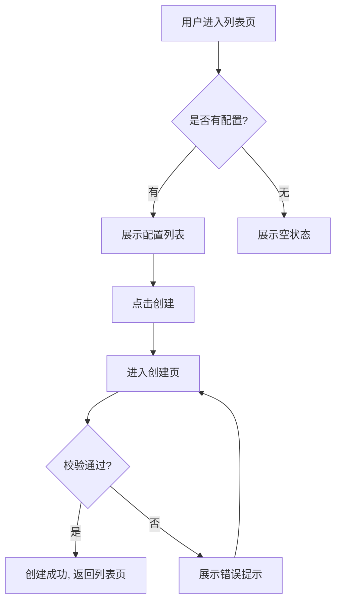

# 示例：模型配置管理详细设计

本示例展示详细设计阶段的完整产出质量标杆。

---

## 结构与流程图：flow-001

### 系统边界

模型配置管理系统包含：配置列表页、配置创建页、配置详情页。不包含模型训练、模型部署。

### 页面映射表

| 页面 | 包含 Story | 入口 | 出口 |
|------|-----------|------|------|
| 配置列表页 | story-002 | 顶部导航 | 创建页、详情页 |
| 配置创建页 | story-001 | 列表页按钮 | 列表页 |

### 业务流程图



---

## 原型文档：proto-001

### 页面列表

1. 配置列表页
2. 配置创建页

### 配置列表页

#### 布局

```
+----------------------------------+
|  模型配置管理        [+ 新建配置] |
+----------------------------------+
|  搜索框              状态筛选     |
+----------------------------------+
|  名称    | 版本 | 状态 | 操作     |
|  v1      | 1.0  | 启用 | 编辑 删除|
+----------------------------------+
|  分页: 1 2 3 ...                 |
+----------------------------------+
```

#### 元素说明

| 元素 | 类型 | 交互 | 备注 |
|------|------|------|------|
| 新建配置 | 按钮 | 跳转创建页 | 主按钮 |
| 搜索框 | 输入框 | 实时搜索 | 防抖 300ms |
| 状态筛选 | 下拉框 | 筛选列表 | 全部/启用/停用 |

#### 异常状态

- 空状态：展示"暂无模型配置，点击新建配置开始"
- 加载中：展示骨架屏
- 错误状态：展示"加载失败，请刷新重试"

---

## 交互契约：contract-001

### 状态机

```
[列表页] -- 点击新建 --> [创建页_编辑中]
[创建页_编辑中] -- 提交成功 --> [创建页_成功]
[创建页_编辑中] -- 校验失败 --> [创建页_错误]
[创建页_错误] -- 用户修正 --> [创建页_编辑中]
[创建页_成功] -- 自动跳转 --> [列表页]
```

### 交互规则表

| 触发 | 校验 | 流转 | 兜底 |
|------|------|------|------|
| 点击提交 | 必填项完整、名称唯一 | 提交中 → 成功 | 校验失败提示具体错误 |
| 网络超时 | 请求失败 | 停留在编辑中 | 提示"网络异常，请重试" |
| 重复提交 | 已有提交在处理中 | 忽略二次提交 | 按钮置灰直到响应返回 |

### 错误提示

| 错误场景 | 提示文案 |
|----------|---------|
| 名称为空 | "请输入模型名称" |
| 名称重复 | "该模型名称已存在" |
| 网络超时 | "网络异常，请稍后重试" |

---

## 规则摘要：rules-001

### 全局规则

1. 所有配置名称全局唯一
2. 配置状态只有"启用"和"停用"两种

### 业务规则

| 规则编号 | 规则描述 | 适用场景 |
|----------|---------|---------|
| R001 | 名称长度 2-50 个字符 | 创建/编辑配置 |
| R002 | 停用状态的配置不参与训练 | 训练任务发起 |

### 异常兜底规则

| 异常场景 | 兜底策略 | 提示文案 |
|----------|---------|---------|
| 网络异常 | 保留表单内容，提示重试 | "网络异常，请稍后重试" |
| 服务端 500 | 记录错误日志，提示用户 | "系统繁忙，请稍后重试" |

---

## Sprint 规划：sprint-001

### 项目总览

- 团队产能：20 人天 / Sprint
- Sprint 长度：2 周
- 总缓冲：15%

### Sprint 列表

#### Sprint 1：实现配置创建和列表查看

| Story | 优先级 | Story Points | 风险 |
|-------|--------|-------------|------|
| story-001 | P0 | 3 | 低 |
| story-002 | P0 | 2 | 低 |

### 风险标注

- 无高风险项

### 关键依赖

- 用户认证系统已接入
- 模型配置数据库表已创建
