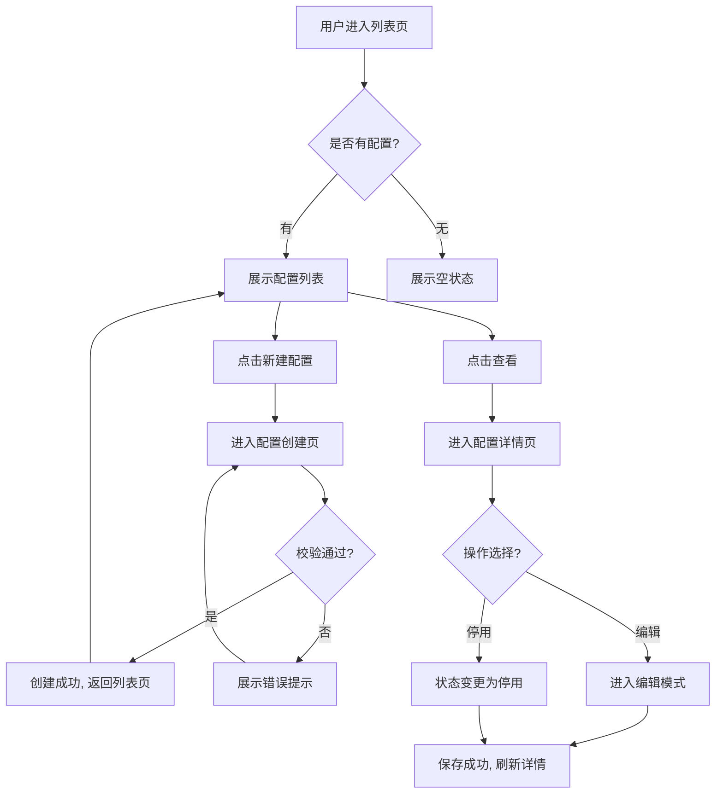
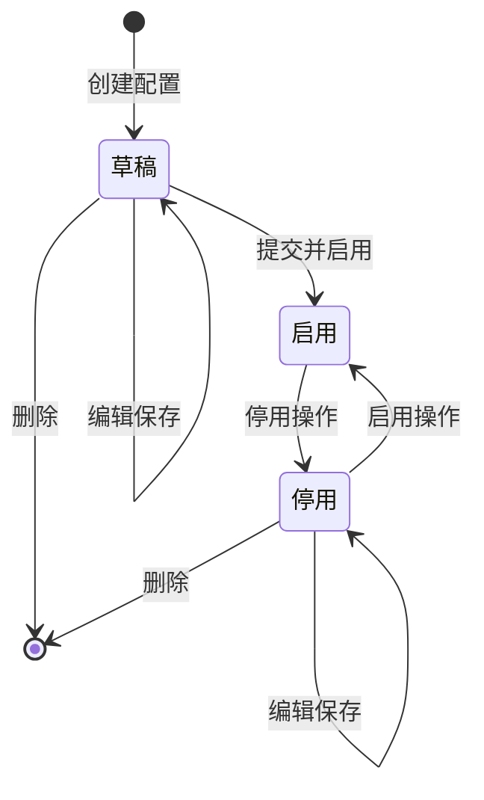

# 示例：模型配置管理详细设计

本示例展示详细设计阶段的完整产出质量标杆。

---

## 结构与流程图：flow-001

### 系统边界

模型配置管理系统包含：配置列表页、配置创建页、配置详情页。不包含模型训练、模型部署。

### 页面映射表

| 页面/模块名称 | 所属层级/导航路径 | 关联 Story | 核心交互与路由说明 |
|------|-----------|------|------|
| 配置列表页 | 侧边栏：模型管理 > 配置列表 | story-002 | 点击"新建配置"跳转至【配置创建页】；点击列表行"查看"跳转至【配置详情页】；支持名称搜索和状态筛选 |
| 配置创建页 | 路由：/config/create | story-001 | 从【配置列表页】"新建配置"按钮进入；提交成功后返回【配置列表页】并刷新列表；取消则返回【配置列表页】 |
| 配置详情页 | 路由：/config/detail/:id | story-003 | 从【配置列表页】点击"查看"进入；提供面包屑导航返回【配置列表页】；支持编辑和停用/启用操作 |

### 业务流程图

> 纯用户操作与页面动线（Mermaid flowchart），不涉及底层技术实现



---

## 原型文档：proto-001

### 原型生成方式

交互式 HTML

### 页面列表

1. 配置列表页
2. 配置创建页
3. 配置详情页

## 页面一：配置列表页

### 布局

```
+------------------------------------------+
|  模型配置管理              [+ 新建配置]   |
+------------------------------------------+
|  搜索框                    状态筛选       |
+------------------------------------------+
|  名称    | 版本 | 状态  | 更新时间 | 操作  |
|  v1      | 1.0  | 启用  | 08-15   | 查看  |
|          |      |       |         | 编辑  |
|          |      |       |         | 删除  |
+------------------------------------------+
|  分页: 1 2 3 ...                         |
+------------------------------------------+
```

### 元素说明

| 元素 | 类型 | 交互 | 反馈 | 备注 |
|------|------|------|------|------|
| 新建配置 | 按钮 | 点击跳转创建页 | 按钮高亮反馈 | 主按钮，权限控制：需配置管理权限 |
| 搜索框 | 输入框 | 实时搜索 | 输入后 300ms 防抖触发搜索 | 支持名称模糊搜索 |
| 状态筛选 | 下拉框 | 筛选列表 | 切换后列表立即刷新 | 选项：全部/启用/停用/草稿 |
| 查看操作 | 链接 | 点击跳转详情页 | 行高亮反馈 | 带路由参数 configId |
| 编辑操作 | 链接 | 点击跳转编辑模式 | 行高亮反馈 | 权限控制：需编辑权限 |
| 删除操作 | 链接 | 点击弹出确认弹窗 | 弹窗确认 | 二次确认，防止误操作 |
| 分页器 | 分页组件 | 切换页码 | 列表刷新 | 每页 20 条 |

### 异常状态

- **空状态**：展示插画图 + 文案"暂无模型配置，点击右上角"新建配置"开始创建"
- **加载中**：展示骨架屏（表格区域显示 5 行占位条），文案"配置列表加载中..."
- **错误状态**：展示错误图标 + 文案"加载失败，请检查网络后刷新重试"，提供"刷新"按钮

### 设计决策记录

> 核心页面的方案对比和推荐理由（借鉴 office-hours 结构：问题陈述 -> 方案对比 -> 推荐方案 -> 成功标准）

**问题陈述**：运营人员需要快速定位需要处理的配置，当前 Story story-002 要求支持搜索和筛选。列表页需要在有限屏幕空间内同时提供搜索、筛选和配置列表展示，且运营人员日常高频使用搜索功能。

**方案 A：顶部搜索栏 + 左侧筛选面板**
- 优点：筛选条件始终可见，操作直觉，适合筛选条件较多的场景
- 缺点：占用屏幕左侧 200px 空间，列表区域变小，配置项较多时需频繁滚动

**方案 B：顶部搜索栏 + 右侧抽屉式筛选**
- 优点：列表区域最大化，筛选按需展开，不影响日常浏览效率
- 缺点：筛选条件默认隐藏，新用户不易发现筛选入口

**推荐**：方案 B，理由：运营人员高频使用搜索而非筛选，列表区域最大化更符合日常操作习惯；筛选为低频操作，按需展开不影响主干流程；通过在筛选图标上标注当前筛选条件数量，可降低发现成本。

**成功标准**：搜索结果在 300ms 内展示、空状态有引导文案、筛选面板可展开/收起且收起时标注已选筛选条件数。

## 页面二：配置创建页

### 布局

```
+------------------------------------------+
|  < 返回列表    新建模型配置               |
+------------------------------------------+
|                                          |
|  配置名称 *                               |
|  [____________________]                  |
|                                          |
|  模型版本 *                               |
|  [____________________]                  |
|                                          |
|  配置描述                                 |
|  [____________________]                  |
|  [____________________]                  |
|                                          |
|  初始状态                                 |
|  ( ) 草稿  ( ) 启用                       |
|                                          |
|  [取消]                    [提交]        |
+------------------------------------------+
```

### 元素说明

| 元素 | 类型 | 交互 | 反馈 | 备注 |
|------|------|------|------|------|
| 返回列表 | 链接 | 点击返回列表页 | 离开确认弹窗 | 如有未保存内容则弹出确认弹窗 |
| 配置名称 | 输入框 | 输入时实时校验 | 失焦时校验唯一性 | 必填，长度 2-50 字符 |
| 模型版本 | 输入框 | 输入时实时校验 | 失焦时校验格式 | 必填，格式：x.y.z |
| 配置描述 | 文本域 | 输入字符 | 实时字数统计 | 选填，最多 200 字 |
| 初始状态 | 单选框 | 切换状态 | 选中高亮 | 默认"草稿" |
| 取消 | 按钮 | 点击放弃并返回 | 离开确认弹窗 | 如有未保存内容则弹出确认弹窗 |
| 提交 | 按钮 | 点击提交表单 | 提交中按钮置灰 | 必填项校验通过后可点击 |

### 异常状态

- **空状态**：表单初始状态，所有输入框为空，提交按钮置灰，提示"请填写必填项"
- **加载中**：提交后按钮显示 loading 状态，文案"提交中..."，防止重复点击
- **错误状态**：校验失败时在对应输入框下方展示红色错误提示；服务端错误展示顶部全局提示"提交失败，请稍后重试"

## 页面三：配置详情页

### 布局

```
+------------------------------------------+
|  < 配置列表    配置详情                   |
+------------------------------------------+
|  配置名称：v1                             |
|  模型版本：1.0                            |
|  当前状态：[启用]          [编辑] [停用]   |
|  创建时间：2025-08-15 10:30               |
|  更新时间：2025-08-16 14:20               |
|  配置描述：                               |
|  这是一个用于文本分类的模型配置...          |
+------------------------------------------+
```

### 元素说明

| 元素 | 类型 | 交互 | 反馈 | 备注 |
|------|------|------|------|------|
| 返回列表 | 链接 | 点击返回列表页 | 面包屑导航 | 带历史路由参数 |
| 编辑 | 按钮 | 点击进入编辑模式 | 跳转编辑页 | 权限控制：需编辑权限 |
| 停用 | 按钮 | 点击弹出确认弹窗 | 确认后状态变更 | 仅启用状态显示，停用后变为"启用"按钮 |
| 状态标签 | 标签 | 展示当前状态 | 颜色区分 | 启用=绿色，停用=灰色，草稿=蓝色 |

### 异常状态

- **空状态**：配置不存在或已删除，展示"该配置不存在或已被删除"，提供"返回列表"按钮
- **加载中**：展示骨架屏（详情区域显示占位条），文案"配置详情加载中..."
- **错误状态**：展示"加载失败，请刷新重试"，提供"刷新"按钮

## 组件复用

| 组件名 | 使用页面 |
|--------|---------|
| 搜索输入框（带防抖） | 配置列表页、配置详情页（编辑模式） |
| 状态标签 | 配置列表页、配置详情页 |
| 确认弹窗 | 配置列表页（删除）、配置详情页（停用）、配置创建页（离开确认） |
| 面包屑导航 | 配置创建页、配置详情页 |
| 表单校验提示 | 配置创建页、配置详情页（编辑模式） |

## UI 规范引用

引用 Ant Design Table, Form, Modal 组件

> 列表页使用 Ant Design Table（含分页、排序），创建页使用 Ant Design Form（含校验），删除/停用确认使用 Ant Design Modal。组件样式遵循 Ant Design 默认主题，不在原型中重复展开组件 props 和样式。

---

## 交互契约：contract-001

### 状态机



状态说明：
- 草稿：新建配置未启用前的初始状态，可编辑、可删除
- 启用：配置处于活跃状态，参与模型训练，可停用、不可删除
- 停用：配置暂停使用，不参与训练，可重新启用或删除

### 交互规则表

| 触发动作 | 校验判断依据（前/后端） | 状态流转与反馈 | 异常兜底处理（GWT） |
|------|------|------|------|
| 点击提交（创建配置） | 前端正则校验必填项 + 后端校验名称唯一性 | 草稿 -> 启用/草稿，提交成功返回列表页 | Given 用户已填写表单但未提交 When 用户点击浏览器关闭按钮 Then 系统弹出确认弹窗"您有未保存的内容，确认离开？" |
| 网络超时 | 请求超时判断（前端 30s 超时） | 停留在编辑中，保留表单内容 | Given 用户已提交请求 When 请求超时 Then 保留表单内容并提示"网络异常，请稍后重试" |
| 重复提交 | 前端防重复（按钮置灰） + 后端幂等校验 | 忽略二次提交，等待首次响应 | Given 用户已点击提交按钮 When 用户在响应返回前再次点击提交 Then 按钮保持置灰状态，忽略二次提交 |
| 权限不足 | 后端校验用户角色权限（RBAC） | 拦截操作，提示无权限 | Given 用户无配置管理权限 When 用户尝试点击"新建配置"或"编辑" Then 按钮置灰或隐藏，提示"您没有执行此操作的权限" |
| 并发编辑冲突 | 后端校验配置版本号（乐观锁） | 拦截后提交，提示冲突 | Given 两人同时编辑同一配置 When 用户A先提交成功 Then 用户B提交时提示"该配置已被他人修改，请刷新后重试" |
| 删除配置 | 后端校验配置状态（启用状态不可删除） | 停用 -> 删除，列表刷新 | Given 配置处于启用状态 When 用户点击"删除" Then 系统提示"启用中的配置不可删除，请先停用" |

### 错误提示

| 错误场景 | 提示文案 |
|----------|---------|
| 名称为空 | "请输入模型名称" |
| 名称重复 | "该模型名称已存在，请修改后重试" |
| 名称长度不合法 | "模型名称长度需为 2-50 个字符" |
| 版本格式错误 | "版本号格式不正确，应为 x.y.z 格式" |
| 网络超时 | "网络异常，请稍后重试" |
| 权限不足 | "您没有执行此操作的权限" |
| 重复提交 | "正在提交中，请勿重复操作" |
| 并发冲突 | "该配置已被他人修改，请刷新后重试" |
| 服务端 500 | "系统繁忙，请稍后重试" |
| 删除启用配置 | "启用中的配置不可删除，请先停用" |

### API 约定

| 接口 | 方法 | 入参 | 出参 |
|------|------|------|------|
| /api/configs | GET | page, pageSize, keyword, status | { total, list: [{ id, name, version, status, updatedAt }] } |
| /api/configs | POST | { name, version, description, status } | { id, name, version, status } |
| /api/configs/:id | GET | id | { id, name, version, status, description, createdAt, updatedAt } |
| /api/configs/:id | PUT | id, { name, version, description, status, versionLock } | { id, name, version, status } |
| /api/configs/:id | DELETE | id | { success: true } |
| /api/configs/:id/status | PATCH | id, { status } | { id, status } |

---

## 规则摘要：rules-001

### 全局规则

1. 所有配置名称全局唯一
2. 配置状态只有"草稿""启用"和"停用"三种
3. 启用状态的配置不可删除，需先停用

### 业务规则

| 规则编号 | 定义与约束摘要 | 影响范围/研发关注点 |
|----------|---------|---------|
| BR-Config-01 | 名称长度 2-50 个字符，支持中英文、数字、下划线 | 创建/编辑配置的前后端校验逻辑 |
| BR-Config-02 | 停用状态的配置不参与训练任务调度 | 训练任务发起时的配置过滤逻辑 |
| BR-Config-03 | 配置版本号格式为 x.y.z（如 1.0.0），不可重复 | 创建/编辑配置的版本校验逻辑 |

### 数据字典

| 规则编号 | 定义与约束摘要 | 影响范围 |
|----------|---------|---------|
| DD-Config-Status | 配置状态机：草稿 -> 启用 -> 停用（可互相转换：草稿可启用、启用可停用、停用可重新启用） | 影响所有展示配置状态的列表页、详情页和交互契约中的状态流转逻辑 |

### 权限控制

| 权限编号 | 定义与约束摘要 | 影响范围 |
|----------|---------|---------|
| NFR-Auth-01 | RBAC + 配置管理权限：仅"配置管理员"角色可创建/编辑/删除配置，其他角色仅可查看 | 影响所有配置管理页面的按钮可见性和接口权限校验 |

### 安全审计

| 编号 | 定义与约束摘要 | 影响范围 |
|----------|---------|---------|
| NFR-Sec-01 | 配置变更留痕：创建、编辑、停用、删除操作需记录操作人、操作时间和变更前后内容 | 影响配置管理所有写操作接口，需接入审计日志模块 |

### 异常兜底规则

| 异常场景 | 兜底策略 | 提示文案 |
|----------|---------|---------|
| 网络异常 | 保留表单内容，提供重试按钮 | "网络异常，请稍后重试" |
| 服务端 500 | 记录错误日志，提示用户稍后重试 | "系统繁忙，请稍后重试" |
| 权限不足 | 拦截操作，隐藏或置灰操作按钮 | "您没有执行此操作的权限" |
| 并发冲突 | 拦截后提交，提示用户刷新后重试 | "该配置已被他人修改，请刷新后重试" |
| 重复提交 | 前端按钮置灰防重复，后端幂等校验 | "正在提交中，请勿重复操作" |

---

## Sprint 规划：sprint-001

### 项目总览

- 团队产能：20 人天 / Sprint
- Sprint 长度：2 周
- 总缓冲比例：15-20%

### Sprint 列表

#### Sprint 1：实现配置创建和列表查看

| Story | 优先级 | Story Points | 风险 | 依赖 |
|-------|--------|-------------|------|------|
| story-001 | P0 | 3 | 低 | 无 |
| story-002 | P0 | 2 | 低 | story-001 |
| story-003 | P1 | 3 | 中 | story-001 |

#### Sprint 2：实现配置详情和状态管理

| Story | 优先级 | Story Points | 风险 | 依赖 |
|-------|--------|-------------|------|------|
| story-004 | P1 | 3 | 中 | story-002 |
| story-005 | P2 | 2 | 低 | story-003 |

### 风险标注

- story-003（配置详情页）：依赖 story-001 的配置数据结构，如数据结构变更需同步调整，标注为中风险
- story-004（状态管理）：涉及状态机流转逻辑，需与后端确认乐观锁实现方案，标注为中风险

### 关键依赖

- 用户认证系统已接入（提供 RBAC 权限校验基础）
- 模型配置数据库表已创建（提供数据持久化基础）
- 审计日志模块已就绪（提供操作留痕能力）
