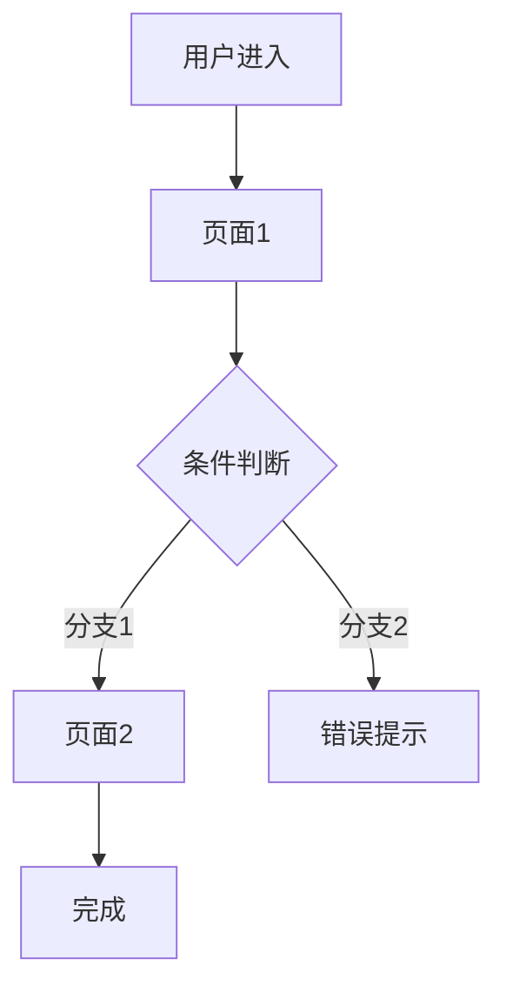

<!-- ID: <简称>-DF-FLOW<nnn> -->

# 结构与流程图

## 功能架构图

功能架构图按用户在 Step 1 二选一的生成方式记录：AI 直出自包含 HTML（同目录 `<简称>-功能架构图.html`）或 Archify HTML；均不可用时 Mermaid 降级图（见下方）。

## 系统边界

系统包含：页面A、页面B、页面C。
系统不包含：外部系统X、物流模块Y。

## 页面映射表

| 页面/模块名称 | 所属层级/导航路径 | 关联 Story | 核心交互与路由说明 |
|------|-----------|------|------|
| 页面A | 侧边栏：模块 > 全部 | US-XX-01 | 点击"查看详情"跳转至页面B |
| 页面B | 页面A（内嵌弹窗） | US-XX-02 | 提交成功后弹窗关闭，列表自动刷新 |

## 业务流程图

> 纯用户操作与页面动线，不涉及底层技术实现。按用户在 Step 1 二选一生成：Mermaid（如下）或自包含 HTML / Archify HTML。

