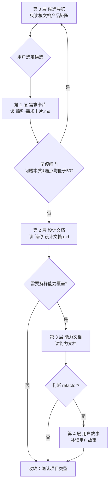

## 产品匹配与复用引导（需求分析 intake）

本流程服务于触发“需求分析”时的项目 intake：在正式进入需求卡片、Epic、Feature 草稿前，帮助用户判断本次需求是否能复用已有产品。完成项目类型确认后，后续需求拆解承接已确认 Feature，详细设计承接已确认 Story/Feature，各自沿阶段 reference 推进。

本文件是产品匹配任务的具体执行 reference。agent 每轮先读取 `instruction.md` 完成路由；当 `mode=intake` 且 workflow 仍处于未完成 intake 时，在背景材料已读取或明确跳过后再读取本文件和 `references/product-library/contract.md`。匹配任务不加载草稿、落盘或质量门的细节 reference。

### 主线规则：分层闸门讨论

产品匹配是一条分层闸门讨论主线，不是一个可自主计算的匹配结论。每一层只读一种产品资产、只围绕该层做一次业务事实核对；下一层资产只能在当前层用户已回答且闸门通过后读取。不得在讨论前一次性读完多层资产，不得跳过核对直接给出匹配等级或项目类型让用户选择。

层与闸门如下：



每一层按同一节拍执行：先读该层资产 -> 用评分口径给该层维度打分（仅用于闸门）-> 批量展示该层字段状态 -> 按“业务事实核对写法”只问一个事实问题 -> 等待用户回答 -> 检查闸门决定下一步。用户回答前不得读取下一层资产。

字段状态表统一四列，每层只填该层资产能回答的字段：

| 字段 | 用户当前需求 | 已有产品对应内容 | 复用/扩展假设 | 状态 |
| --- | --- | --- | --- | --- |
| `{该层字段名}` | `{用户表述}` | `{已有产品字段}` | `{相同/相近/需扩展}` | 已确认/待验证/缺失 |

### 评分口径（逐层闸门用）

评分只用于驱动闸门和收敛时的等级汇总，不作为自主匹配结论。维度与权重：问题本质 30%、痛点 25%、现状 15%、业务场景 15%、用户角色 10%、业务领域 5%。每维按语义等价、包含、相关、弱相关、无关分别记 100、75、50、25、0。总分不低于 75 为 high，50–74 为 medium，25–49 为 low，其余为 none。每维必须给出来源和理由，用户可覆盖结论。

分层打分：第 0 层只用业务领域做候选初筛；第 1 层只评问题本质、痛点、现状；第 2 层补评业务场景、用户角色。早停闸门：第 1 层若问题本质与痛点都低于 50，立即早停返回第 0 层，不读设计文档。核心问题与痛点都不低于 75 时，收敛等级不得低于 medium；领域不同但问题本质一致时，标注可复用设计思路。匹配等级在收敛时按各层已确认事实汇总，不得在讨论前预计算。

### 第 0 层：候选导览

背景材料已在 intake 收集（前置规则见 `instruction.md`，流程见 `workflows/intake.md` 第 2 步）；本层基于已读背景摘要与根文档产品矩阵生成候选导览。读取产品库不是为了让用户判断陌生产品，而是为了把已有产品翻译成用户能理解的业务语言，再围绕用户自己的需求事实做核对。

只读取 `productArchitectureDesignPath` 根文档中的产品全名、简称、产品定位和能力索引，不额外读取产品文档。产品库中存在多个 low 及以上候选产品时，不要立即深挖某一个产品。建议优先级仅基于业务领域初筛，不计算问题本质/痛点/场景/角色深度分。

导览展示每个候选的简称、定位原文和初筛等级：候选用简称；定位照搬根文档原文，不缩写；“建议优先级”只填等级，不写理由（理由只放进下方选择题选项）。导览不展示“可能重叠的业务闭环”“可能扩展的方向”两方面内容--这两方面需读设计文档/能力文档正文，留到第 2、3 层再展示。导览后只问一个选择题：

```text
我先找到了几个可能相关的已有产品。我会先帮你拆解它们分别覆盖什么，再根据你的业务事实判断复用空间。
你想先了解哪一个候选？

A. {候选 1}：{一句话说明为什么可能相关}
B. {候选 2}：{一句话说明为什么可能相关}
C. {候选 3}：{一句话说明为什么可能相关}
D. 补充描述：我自己填写
E. 强制跳过：暂不看候选产品，记录为待验证并继续
```

用户选定候选后进入第 1 层。只有一个 high/medium 候选时，跳过本题直接进入第 1 层，但仍先展示该候选的导览内容。

### 第 1 层：需求卡片

仅读候选产品的 `简称-需求卡片.md`，不得同时读设计文档、能力文档或用户故事。评问题本质、痛点、现状三维度用于早停闸门。字段状态表填：问题本质、现状痛点。

展示需求卡片层解读：已有产品要解决的业务问题、现状痛点、问题本质、评估结果。按“业务事实核对写法”问一个事实问题。用户回答后检查早停闸门：问题本质与痛点都低于 50 时，立即早停返回第 0 层候选导览；否则进入第 2 层。

### 第 2 层：设计文档

早停闸门通过后才读候选产品的 `简称-设计文档.md`。补评业务场景、用户角色两维度。字段状态表填：目标用户、核心场景。

展示 Epic 层解读：已有产品的产品定位、目标用户、核心场景、范围边界和建设思路。此层才展示导览阶段省略的“可能重叠的业务闭环”“可能扩展的方向”两方面内容，数据来自已读设计文档正文。按“业务事实核对写法”问一个事实问题。用户回答后检查闸门：若仍需解释具体能力如何覆盖用户需求，进入第 3 层；否则进入收敛。

### 第 3 层：能力文档

仅在需要解释能力覆盖时读取相关能力文档（`简称-能力-能力文档.md` 或 `简称-父能力-子能力-能力文档.md`），按需读、不全读。字段状态表填：已覆盖能力、可扩展能力。

展示 Feature 层解读：已有产品已经有哪些能力，哪些能力可能直接覆盖用户需求，哪些可能通过扩展覆盖。对照“扩展优先判断”表解释差异方向。按“业务事实核对写法”问一个事实问题。用户回答后检查闸门：若收敛方向倾向 `refactor`（业务闭环沿用但需推倒重来或非功能性改造），进入第 4 层；否则进入收敛。

### 第 4 层：用户故事

仅在判断 `refactor` 时补读相关用户故事（`简称-能力-用户故事NN.md` 或 `简称-父能力-子能力-用户故事NN.md`），用于确认现有实现的系统性问题。字段状态表填：现有实现链路、规则实现或性能稳定性问题点。

展示用户故事层证据后，按“业务事实核对写法”问一个事实问题。用户回答后进入收敛。

### 业务事实核对写法

每轮问题围绕用户一开始需求中的关键字段展开。系统先提出复用假设，再问一个用户能直接确认的业务事实；用户回答事实，系统在回合后更新复用判断。每层只问一个问题，下一层资产在用户回答并过闸后才读。

问题由四段组成：

1. **用户需求复述**：用用户自己的业务语言复述本次目标。
2. **已有产品解读**：说明已有产品覆盖的业务问题、场景或能力。
3. **系统复用假设**：说明系统当前推测可以复用什么、差异可能落在哪类扩展上。
4. **业务事实问题**：只问一个事实字段，例如业务时点、资源对象、目标角色、数据来源、校验动作、规则口径、流程边界或验收结果。

选项写成业务事实短句，让用户选择自己真实的业务情况：

```text
你的需求是「{用户需求复述}」。
我注意到已有产品已经覆盖「{已有产品业务语言解释}」。
我的初步判断是：可以先尝试复用「{已有 Epic/Feature/能力}」，差异可能落在「{扩展方向}」。

本轮我先核对一个业务事实：{围绕需求卡片/Epic/Feature 字段的问题}

A. {业务事实选项 1，例如发生在某业务时点/面向某角色/处理某类资源对象}
B. {业务事实选项 2，例如发生在另一个业务时点/接入另一类数据源/采用另一种规则口径}
C. {业务事实选项 3，例如覆盖更完整流程/更高频场景/更大组织范围}
D. {当前事实还不确定，需要先按待验证记录}
E. 补充描述：我自己填写
F. 强制跳过：这个问题暂时不回答，记录为待验证并继续
```

系统根据用户选择更新“已有产品已覆盖 / 本次新增或变化 / 仍待确认”的判断，再决定下一轮核对哪个字段或是否过闸。

### 扩展优先判断

做产品匹配时先发散地寻找“如何在已有产品上扩展”。字段差异优先进入扩展解释，常见扩展方向包括：

| 差异类型 | 优先解释 |
| --- | --- |
| 角色不同 | 先判断是否同一大领域角色；若是，通常是新增目标角色或权限视角 |
| 资源对象不同 | 先判断是否同资源模型的子类、扩展属性或新对象类型 |
| 规则不同 | 先判断是否新增校验规则、阈值、例外规则或规则版本 |
| 数据来源不同 | 先判断是否新增数据源、接口、采集口径或字段映射 |
| 流程不同 | 先判断是否新增流程分支、审批节点、处理状态或编排方式 |
| 场景不同 | 先判断是否已有核心场景的上下游、前后置或子场景 |
| 入口不同 | 先判断是否新增工作台、菜单、任务入口或角色视图 |
| 统计分析不同 | 先判断是否新增指标、报表、看板或预警口径 |
| 组织范围不同 | 先判断是否新增组织层级、区域范围、租户或权限边界 |

只有当共同问题本质、业务闭环、目标用户链路和核心数据对象都无法与已有产品建立合理关系时，才倾向 `new`。

### 收敛为项目类型

只有按闸门实际走过的层都已讨论、业务事实已核对后，才进入收敛；不得跳过适用层直接收敛。结合从 `productArchitectureDesignPath` 读取的根文档汇总立项建议：

- 倾向 `iteration`：已有产品的问题本质和业务闭环成立，本次差异主要落在角色、对象、规则、数据源、流程、场景、入口、统计或权限扩展。
- 倾向 `refactor`：业务闭环和产物定义应沿用已有产品，但用户明确指出现有方案架构、性能、稳定性、体验或规则实现存在系统性问题，需要推倒重来或非功能性改造。
- 倾向 `new`：本次需求的业务目标、用户链路、核心对象或价值主张与已有产品不同，继续挂接会造成产品定位混乱或重复约束。

收敛时按各层已确认事实汇总匹配等级，不得在讨论前预计算。匹配结论必须包含：候选产品、匹配等级、已读产品资产范围、覆盖点、差异点、推荐项目类型、架构设计影响判断和待用户确认的理由。

匹配结论交回 `instruction.md` 的 intake 路由：由本 agent 向用户确认 `projectType`。只有类型已确认时才调用 `init-project.sh` 初始化正式项目，并返回唯一状态 `status=intake-initialized`，供主调度器在下一轮按项目状态委派需求分析。

### 交互与输出格式

遵守主调度器 handoff 中的 `interactionContract`。提问与呈现格式（每轮一题、大写字母选项、兜底、表格或平铺）统一按 `references/orchestrator/output-format.md`，本文件不重复规定。

每次向用户提出下一问前，必须先给出 2-5 行“当前理解回执”：已确认了什么、还缺什么、当前追问属于整体问题地图的哪个位置、当前处于第几层。
