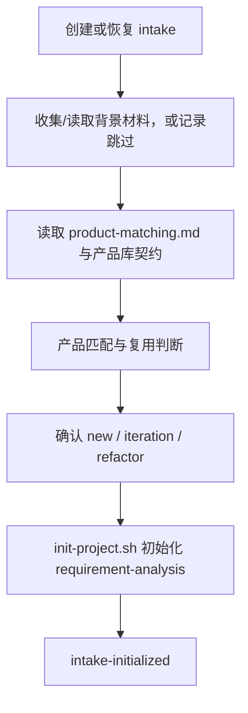

# 需求分析 intake 工作流

**前置条件**：顶层管线已完成第 1 步，且 `mode=intake`。本文件是 intake 的唯一执行入口；主调度器只转发问题和结果。

**按需读取**：第 1 步创建或恢复 intake；第 2 步读取背景材料；仅第 3 步读取 `../guides/product-matching.md` 与 `references/product-library/contract.md`。材料安全规则不重复读取，沿用第 1 步加载的 `../guides/evidence-and-input.md`。

**允许写入**：仅 intake 目录、`docs/background/` 的用户材料记录和初始化所需项目状态；不得创建字段 JSON、正式需求文档或阶段产物。

**用户问题**：每轮只提出一个问题；先补齐项目基本信息，再处理背景材料，再确认项目类型。

**终点**：缺少事实时 `needs-input`，路径或状态非法时 `blocked`，初始化完成后 `intake-initialized`。



## 第 1 步：创建或恢复 intake

### 首次创建 intake（无 `projectPath`）

收集以下信息：
1. **项目 ID**（格式：`^[a-z0-9][a-z0-9-]{0,62}$`）
2. **产品名称**（完整的产品名称）
3. **产品简称**（AI 自动生成，供用户确认）
4. **初始描述**（需求的简要描述）

**产品简称生成与确认流程**：
- 当用户提供产品名称后，AI 自动从中提取 2-5 个字作为产品简称
- 展示建议：
  ```markdown
  产品名称：{用户输入的完整名称}
  建议简称：{AI 提取的简称}（用于文件夹命名和文档标识）
  
  产品简称将用于：
  - 产品库文件夹命名
  - 能力文档文件夹命名（如：{简称}-数据管理类能力/）
  - 能力文档文件名前缀
  
  以上简称是否合适？如需调整，请直接提供您期望的简称（2-5 个字）。
  ```
- 用户确认或调整简称
- **重名校验**：在调用 `prepare-intake.sh` 前，先检查产品库中是否已有同名产品：
  - 检查 `selectedProductLibraryPath` 下是否存在名为 `{产品名称}` 或包含 `{产品简称}` 的文件夹
  - 若存在重名，提示用户："产品库中已存在同名产品，建议调整产品名称或简称以避免混淆"
  - 用户确认后继续或调整名称

信息齐全且无重名冲突后，调用 `prepare-intake.sh` 创建项目：
```bash
bash prepare-intake.sh <project_id> <project_name> <product_short_name> <target_dir> <selected_product_library_id> <selected_product_library_path> <initial_description>
```

校验脚本返回的 `projectPath` 与 `backgroundDirectory`，确认它们位于 `projectRoot` 内且不存在符号链接。

### 恢复已有 intake（有 `projectPath`）

确认 `projectPath` 是 `projectRoot` 的直接子目录且 `workflow.state=collect-background`。从 `progress.json` 读取已记录的产品名称和简称。

### 终点条件

缺少事实时返回一个 `needs-input`；路径或状态非法时返回 `blocked`。

## 第 2 步：背景材料

引导用户将参考文件放入 `<projectPath>/docs/background/` 后再读取；用户明确跳过时记录“无前置背景材料”。文件转换、材料安全与事实处理一律遵循已在第 1 步读取的 `../guides/evidence-and-input.md`。

## 第 3 步：产品匹配

仅在背景材料已读取或明确跳过后，读取 `../guides/product-matching.md` 和 `references/product-library/contract.md`。产品候选导览、产品解读、业务事实核对和复用判断只按 `../guides/product-matching.md` 执行。

## 第 4 步：确认项目类型

根据匹配结论，由本 agent 向用户确认 `new`、`iteration` 或 `refactor`。每轮只问一个问题；此步骤不进入正式需求字段追问。

## 第 5 步：初始化并返回

类型确认后调用 `init-project.sh`，传入产品名称和简称（从 intake 的 `progress.json` 读取），初始状态固定为 `requirement-analysis`：
```bash
bash init-project.sh <project_id> <project_name> <product_short_name> <description> <project_type> <selected_product_library_id> <selected_product_library_path> <matched_product_id> <product_library_match> <template_dir> <target_dir> [initial_workflow_state] [source_product_id]
```

返回 `intake-initialized` 及内部项目状态回执（包含产品名称和简称）；不得在同一调用中起草需求卡片、Epic 或 Feature。
