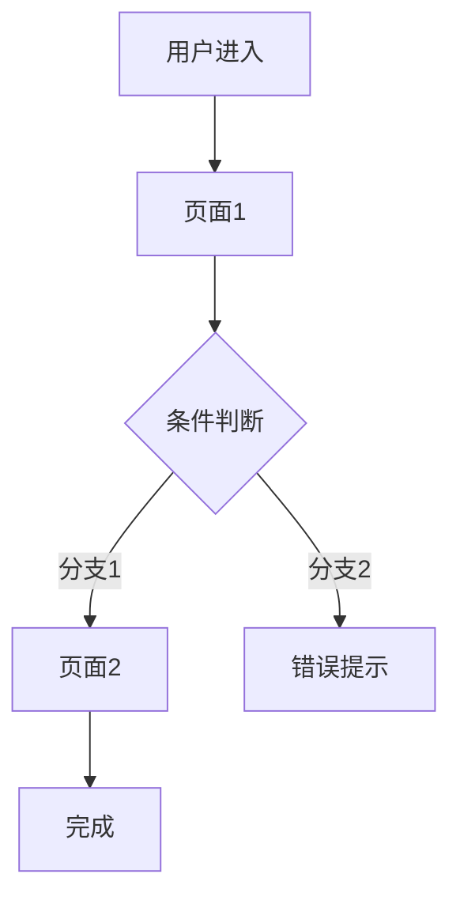

# 结构与流程图

## 系统边界

{{SYSTEM_BOUNDARY}}

## 页面映射表

| 页面 | 包含 Story | 入口 | 出口 |
|------|-----------|------|------|
| {{PAGE_1}} | story-001, story-002 | {{ENTRY_1}} | {{EXIT_1}} |
| {{PAGE_2}} | story-003 | {{ENTRY_2}} | {{EXIT_2}} |

## 业务流程图

