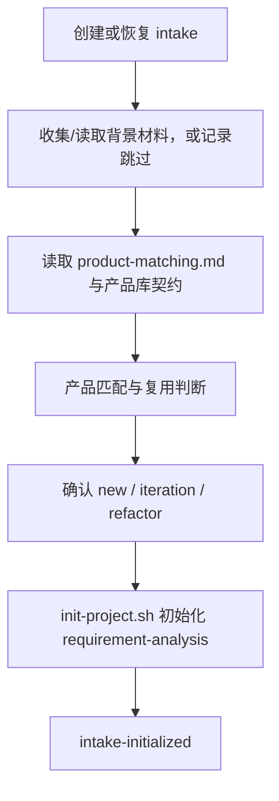

# 需求分析 intake 工作流

**前置条件**：顶层管线已完成第 1 步，且 `mode=intake`。本文件是 intake 的唯一执行入口；主调度器只转发问题和结果。

**按需读取**：第 1 步创建或恢复 intake；第 2 步读取背景材料；仅第 3 步读取 `../guides/product-matching.md` 与 `references/product-library/contract.md`。材料安全规则不重复读取，沿用第 1 步加载的 `../guides/evidence-and-input.md`。

**允许写入**：仅 intake 目录、`docs/background/` 的用户材料记录和初始化所需项目状态；不得创建字段 JSON、正式需求文档或阶段产物。

**用户问题**：每轮只提出一个问题；先补齐项目基本信息，再处理背景材料，再确认项目类型。

**终点**：缺少事实时 `needs-input`，路径或状态非法时 `blocked`，初始化完成后 `intake-initialized`。

## 第 1 步：创建或恢复 intake

无 `projectPath` 时收集安全的项目 ID、名称和初始描述；齐全后调用 `prepare-intake.sh` 创建项目，并校验脚本返回的 `projectPath` 与 `backgroundDirectory`。已有 `projectPath` 时确认它是 `projectRoot` 的直接子目录且 `workflow.state=collect-background`。缺少事实时返回一个 `needs-input`；路径或状态非法时返回 `blocked`。

## 第 2 步：背景材料

引导用户将参考文件放入 `<projectPath>/docs/background/` 后再读取；用户明确跳过时记录“无前置背景材料”。文件转换、材料安全与事实处理一律遵循已在第 1 步读取的 `../guides/evidence-and-input.md`。

## 第 3 步：产品匹配

仅在背景材料已读取或明确跳过后，读取 `../guides/product-matching.md` 和 `references/product-library/contract.md`。产品候选导览、产品解读、业务事实核对和复用判断只按 `../guides/product-matching.md` 执行。

## 第 4 步：确认项目类型

根据匹配结论，由本 agent 向用户确认 `new`、`iteration` 或 `refactor`。每轮只问一个问题；此步骤不进入正式需求字段追问。

## 第 5 步：初始化并返回

类型确认后调用 `init-project.sh`，初始状态固定为 `requirement-analysis`。返回 `intake-initialized` 及内部项目状态回执；不得在同一调用中起草需求卡片、Epic 或 Feature。
